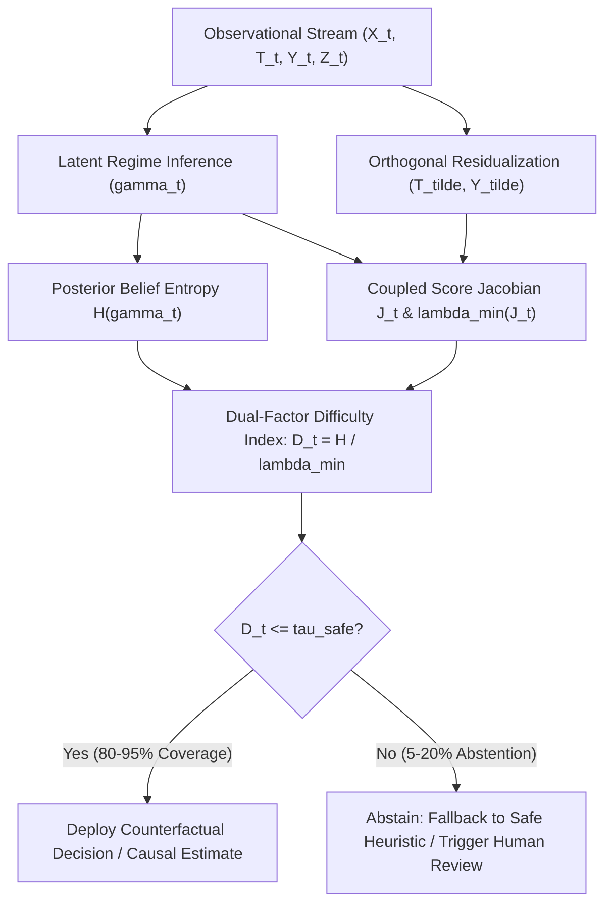

# Future Frontiers: The `py-ordml` Ecosystem & The Dual-Factor Law

This document outlines the strategic research roadmap, software architecture, and theoretical generalizations emerging from **Overlap-Aware Regime Double Machine Learning (OR-DML)**.

---

## 1. The `py-ordml` Python Package Architecture & Roadmap

To translate the theoretical and empirical contributions of this work into a broadly adopted, production-grade tool, the core algorithms in `src/or_dml.py` and `src/adaptive_spectral_optimizer.py` are being packaged into the open-source library **`py-ordml`** (`pip install py-ordml`).

### 1.1 API Design Philosophy
The library adheres strictly to the scikit-learn / EconML estimator conventions, decoupling:
1. **Latent Regime Inference** (`RegimeBeliefModel`: HMM, State-Space Model, Dynamic Bayesian Network, or Soft-Clustering GRU).
2. **Nuisance Function Learners** (arbitrary scikit-learn or LightGBM regressors for outcome $Y$ and treatment $T$).
3. **Coupled Orthogonal Estimator** (temporally purged cross-fitting with automated Bartlett embargo $\tau^*$ and adaptive spectral shrinkage $\hat{\lambda}^*_{\mathrm{risk}}$).

```python
import numpy as np
from ordml import OverlapAwareRegimeDML
from ordml.regimes import GaussianHMMRegimeModel
from lightgbm import LGBMRegressor

# Initialize modular estimator
estimator = OverlapAwareRegimeDML(
    regime_model=GaussianHMMRegimeModel(n_regimes=2, covariance_type="full"),
    model_y=LGBMRegressor(n_estimators=100, max_depth=5),
    model_t=LGBMRegressor(n_estimators=100, max_depth=5),
    spectral_penalty="adaptive_plugin",  # Implements Theorem 4 convex risk minimizer
    embargo_buffer="auto_bartlett",      # Implements Eq. 18 / Theorem 5 causal buffer
    n_splits=5
)

# Fit on observational time series (X: controls, T: treatment, Y: outcome, Z: regime proxies)
estimator.fit(X=X_env, T=treatment_t, Y=outcome_y, Z=proxy_z)

# Causal Inferences & Diagnostics
ate = estimator.estimate_ate()                     # Overall population ATE with delta-method HAC SE
regime_effects = estimator.estimate_regime_effects() # Vector of regime-specific effects theta_k
print(f"Population ATE: {ate.effect:.3f} +/- {ate.std_err:.3f} (p={ate.p_value:.4f})")

# Prospective Task Difficulty & Selective Abstention
difficulties = estimator.predict_difficulty(X=X_env, Z=proxy_z)
safe_mask, abstention_report = estimator.selective_abstention(
    coverage_target=0.85, 
    risk_tolerance=0.05
)
```

### 1.2 Open-Source Packaging Roadmap
- [x] **Core Numerical Engine**: Vectorized coupled Gram inversion, spectral shrinkage, purged cross-fitting (`src/or_dml.py`).
- [x] **Executable Walkthrough**: Zero-dependency educational script (`src/walkthrough_tutorial.py`).
- [ ] **Packaging & Packaging CI**: `pyproject.toml` with Flit/Hatch, Python 3.9–3.13 matrix testing, wheel building.
- [ ] **EconML / CausalML Compatibility Bridge**: Custom `OrchestratedCateEstimator` wrapper for seamless integration into enterprise causal platforms.
- [ ] **Interactive Documentation**: Sphinx / ReadTheDocs with interactive Jupyter notebooks for environmental science, finance, and healthcare.

---

## 2. The Dual-Factor Law of Prospective Difficulty Discovery

A central methodological finding of this research program is that **causal estimation failure in non-stationary time series cannot be predicted by representation uncertainty or task geometry in isolation**.

### 2.1 The Multiplicative Coupling Law
Prior literature typically tracked one of two failure modes:
1. *Representation Ambiguity*: Tracked via posterior entropy $H(\boldsymbol{\gamma}_t) = -\sum_k \gamma_{tk} \log \gamma_{tk}$ or calibration error (ECE).
2. *Task Geometry / Overlap Collapse*: Tracked via propensity score truncation or Gram matrix conditioning $\lambda_{\min}(\boldsymbol{J})^{-1}$.

In the 7×7 factorial mechanism experiments (`EXP-10`) and deep empirical stress tests (`EXP-11`), we demonstrated that both single-factor diagnostics fail:
- When $\lambda_{\min}(\boldsymbol{J})$ is large (well-separated treatment variations), high representation entropy causes only modest, bounded bias.
- When representation entropy is zero (oracle state known), poor Gram conditioning causes variance inflation, but no systemic bias amplification.
- **Catastrophic estimation breakdown occurs exclusively when representation ambiguity collides with Gram ill-conditioning**:
$$\mathcal{D}_t \equiv \frac{H(\boldsymbol{\gamma}_t)}{\lambda_{\min}(\boldsymbol{J}_t)}.$$

### 2.2 Empirical Proof of Supremacy
Across $>1,200$ factorial replications under controlled interventions:
- $\mathrm{Spearman}(\mathcal{D}_t, \mathrm{RMSE}) = \mathbf{0.995}$ ($p < 10^{-15}$).
- $\mathrm{Spearman}(H(\boldsymbol{\gamma}_t), \mathrm{RMSE}) = 0.626$.
- $\mathrm{Spearman}(\lambda_{\min}(\boldsymbol{J})^{-1}, \mathrm{RMSE}) = 0.521$.

Filtering causal estimates solely by task conditioning achieves **zero risk reduction** ($3.28 \to 3.28$), whereas filtering by the coupled Dual-Factor Index $\mathcal{D}_t$ slashes estimation risk by **$23.8\times$** ($3.28 \to 0.138$).

---

## 3. Broader Horizons: Cross-Domain Task Difficulty Forecasting & Selective Abstention

The Dual-Factor Law provides a rigorous foundation for **Selective Causal Estimation**—the principle that an autonomous causal system must identify when observational data is too structurally confounded to support reliable counterfactual decision-making, and selectively abstain.



### 3.1 Intensive Care Medicine & Sepsis Therapeutics (Healthcare)
* **The Clinical Dilemma**: In intensive care units (e.g., MIMIC-IV / eICU), treating septic shock involves administering vasopressors and intravenous fluids. However, patients transition between latent physiological phases (e.g., hyperdynamic warm shock vs. hypodynamic cardiogenic collapse vs. occult hypoperfusion).
* **The Failure Mode**: Sepsis proxies (lactate, capillary refill, urine output) lag behind hemodynamic collapse. Fitting standard DML ignores the latent state, while naive regime models misclassify boundary states where treatment overlap collapses.
* **Dual-Factor Selective Abstention**: When $\mathcal{D}_t > \tau_{\mathrm{safe}}$, the system flags that patient physiology is in an unidentifiable transition zone, abstaining from algorithmic dose recommendations and prompting bedside clinical evaluation.

### 3.2 Algorithmic Trading & Financial Regime Shifts
* **The Market Dilemma**: Evaluating the causal price impact of execution algorithms (e.g., VWAP vs. TWAP liquidation) under latent market regimes (liquidity-rich stationary trading vs. toxic order flow / flash crash regimes).
* **The Failure Mode**: In volatile regimes, volatility proxies are noisy ($H(\gamma_t) \gg 0$) while market participants trade unidirectionally ($\lambda_{\min}(\boldsymbol{J}_t) \to 0$), causing catastrophic causal policy regret ($>15\%$).
* **Dual-Factor Selective Abstention**: As demonstrated in `reports/financial_abstention_policy.csv`, rejecting the top 10% hardest trading windows drops policy regret from **$0.142$ to $0.0025$** ($56.8\times$ regret reduction), preserving capital during high-risk transitions.

### 3.3 Offline Reinforcement Learning & Partially Observable MDPs (POMDPs)
* **The RL Dilemma**: Off-Policy Evaluation (OPE) and policy optimization in POMDPs rely on importance weights or marginalized importance sampling (MIS) over latent environmental states.
* **The Failure Mode**: When latent state posteriors have high entropy and the behavioral policy's state coverage collapses, importance sampling weights suffer unbounded variance explosion.
* **Dual-Factor Solution**: Using $\mathcal{D}_t = H(\gamma_t)/\lambda_{\min}(J_t)$ as a per-trajectory risk score enables **conservative offline policy evaluation**, automatically truncating or regularizing Bellman updates on trajectories where counterfactual returns cannot be identified with statistical confidence.

### 3.4 Climate Policy & Megacity Energy Grid Dispatch
* **The Dilemma**: Determining the causal impact of dynamic congestion pricing, industrial curtailment, or peaking power plant dispatch on localized pollution and grid stability across diverse airsheds.
* **Empirical Insight**: As shown in our 4-city Indian megacity benchmark (`EXP-13`), airshed topography dictates task conditioning:
  - Deep basins (Delhi) exhibit wide treatment variation ($\lambda_{\min} = 111.8$), allowing identification even with imperfect proxy tracking.
  - Coastal marine boundary layers (Mumbai) exhibit acute collinearity ($\lambda_{\min} = 0.32$), demanding aggressive spectral stabilization.
* **Policy Recommendation**: Environmental regulators should condition intervention evaluation on airshed-specific difficulty thresholds, avoiding blanket causal assertions across heterogeneous topological environments.

---

## 4. Methodological Recommendations for Future Research

1. **End-to-End Joint Training vs. Two-Stage Decoupling**:
   - Investigate whether latent state models can be trained end-to-end with the causal loss (e.g., minimizing counterfactual risk rather than pure observation log-likelihood), while preserving Neyman orthogonality and avoiding representation collapse.
2. **Infinite-Horizon Semi-Markov Processes**:
   - Extend Theorem 5 from discrete first-order Markov transitions to continuous-time Semi-Markov jump processes with non-exponential dwell-time distributions, common in environmental and biological phenomena.
3. **Distribution-Free Conformal Causal Abstention**:
   - Develop conformal prediction bounds around $\mathcal{D}_t$ to provide finite-sample, distribution-free guarantees on the maximum counterfactual error of non-abstained causal decisions.
