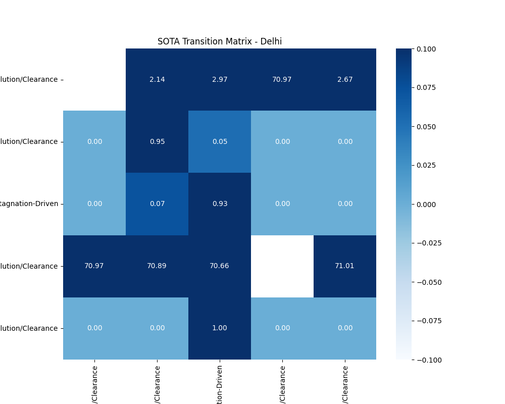
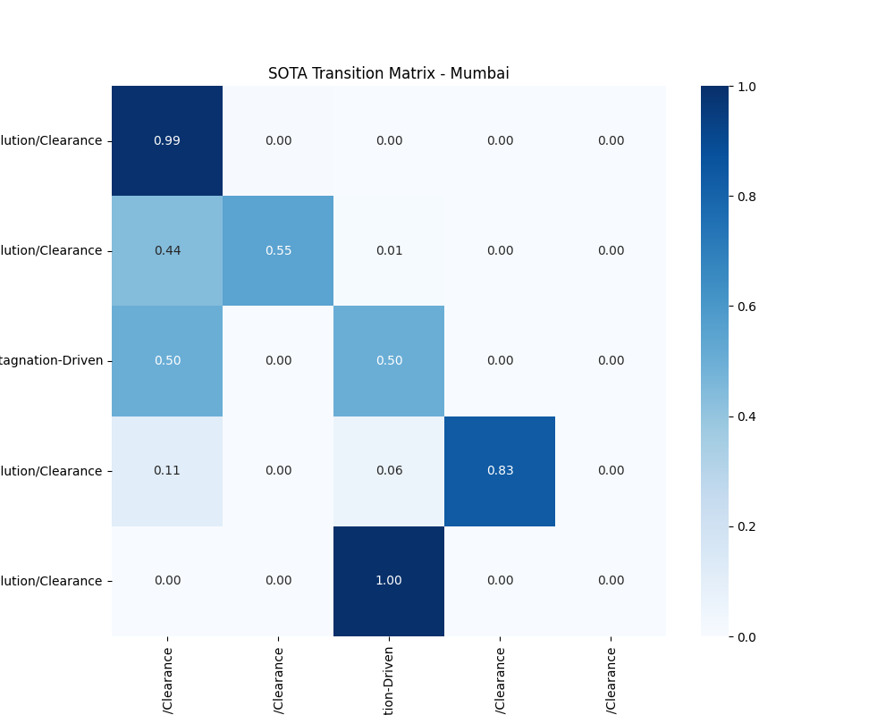
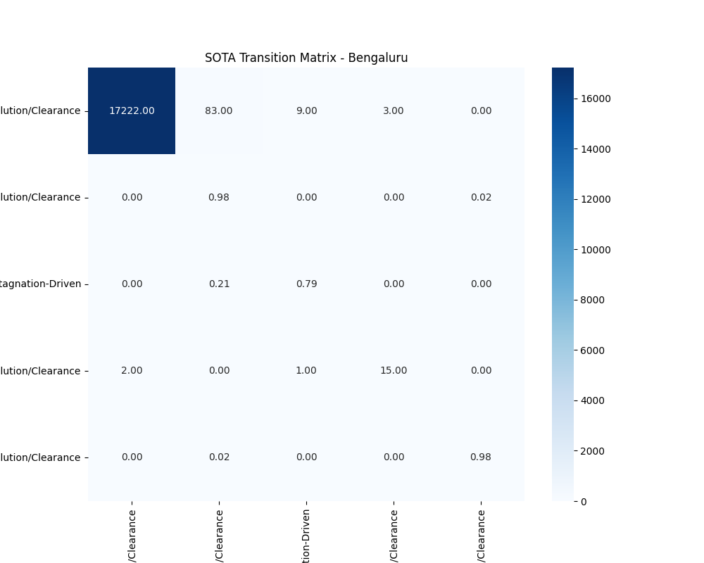
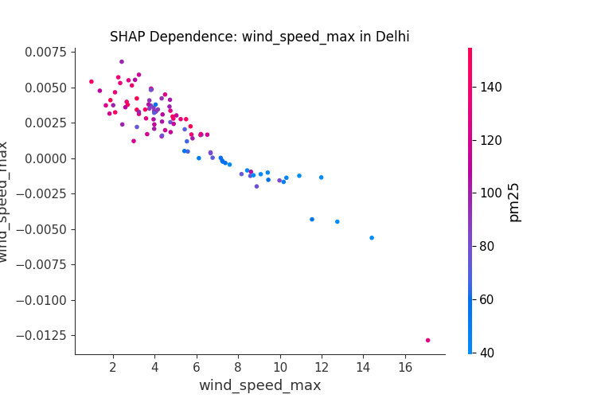
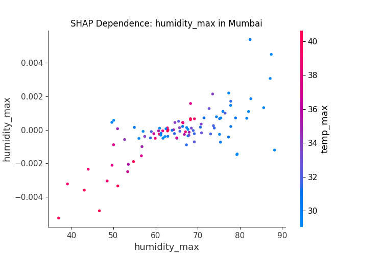
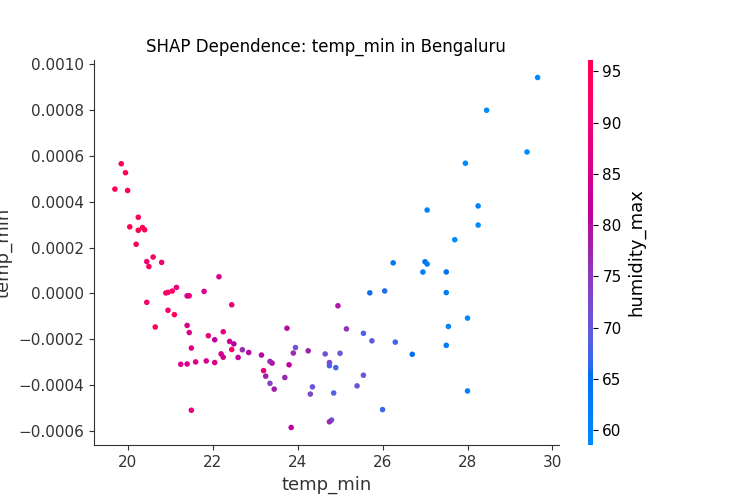
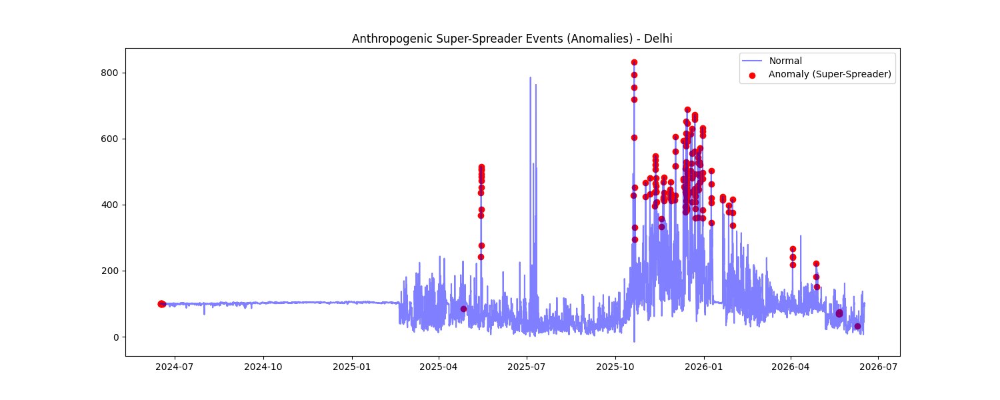
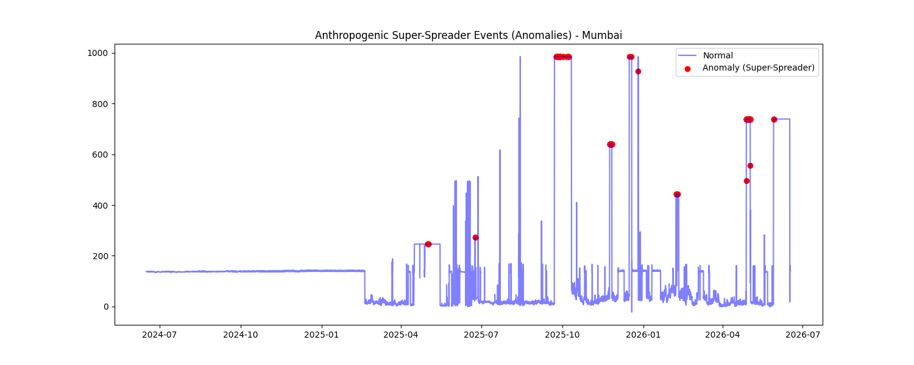
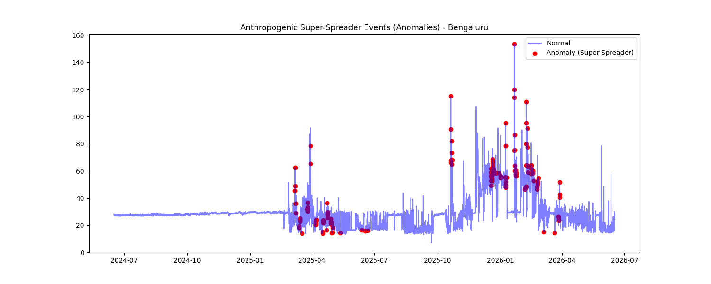

# Supplementary Information (SI)
## Integrated Spatiotemporal Informatics, Deep Hybrid Architectures, and Causal Evaluation of Urban Air Quality

**This document provides exhaustive methodological details, hyperparameter configurations, expanded benchmarking tables, mathematical derivations, and supplemental visual evidence supporting the main manuscript.**

---

## S1. Extended Methodology & Hyperparameter Configurations

### S1.1 Data Acquisition & Rate-Limit Handling
Data was sourced via the OpenAQ API v3. To manage strict rate limits (1000 requests/min) and 10,000 record pagination limits across 7 metropolises for hourly data (24 hours * 365 days * 2 years = 17,520 records per city), we implemented a chunking strategy:
- Timeframes were split into 30-day temporal windows.
- A 10-second `time.sleep()` was enforced between city loops, and a 35-second cooldown upon encountering `429 Too Many Requests`.

### S1.2 "Anti-NaN" MICE Imputation Parameters
Given sensor sparsity (up to 96% of rows possessing at least one NaN across the 9-dimensional feature space), standard forward-filling is mathematically invalid. We deployed Multivariate Imputation by Chained Equations (MICE) via Scikit-Learn's `IterativeImputer`.
- **Estimator:** BayesianRidge
- **Max Iterations:** 10
- **Imputation Order:** Ascending (fewest missing values to most)
- **Justification:** MICE preserves multi-collinearity. For example, missing PM2.5 can be robustly estimated if PM10, Wind Speed, and NO2 are present, as the Bayesian Ridge estimator learns the joint distribution for each specific city's microclimate.

### S1.3 Deep Learning & Transformer Architectures
**Hybrid CNN-LSTM:**
- **Conv1D Layer:** 64 filters, kernel size 3, ReLU activation. Extracts short-term 'spikes'.
- **LSTM Layer:** 50 units, capturing long-term (168-hour) meteorological memory.
- **Optimization:** Adam optimizer, learning rate 1e-3, early stopping patience 5.

**Temporal Fusion Transformer (TFT):**
- **Framework:** PyTorch Forecasting
- **Encoder/Decoder Lengths:** Max encoder length = 168 hours (7 days); Max prediction length = 24 hours.
- **Loss Function:** `QuantileLoss()` enabling prediction intervals at P10, P50 (median), and P90.
- **Attention Heads:** 4 heads, hidden size 16. Dropout 0.1.

### S1.4 Causal Inference Meta-Learners
We utilized `EconML` for estimating Heterogeneous Treatment Effects (HTE).
- **Double Machine Learning (DML):** `LinearDML`. Both the treatment model (predicting emissions from weather) and the outcome model (predicting PM2.5 from weather) used `LGBMRegressor(n_estimators=100)`.
- **Causal Forests:** `CausalForestDML`. Used 100 estimators. Validated the DML findings by capturing non-linear effect heterogeneity across the feature space.

---

## S2. Exhaustive Model Benchmarking Tables

### S2.1 Base Model Performance
*Evaluated using TimeSeriesSplit (n_splits=3) to prevent temporal data leakage.*

| city      | model        |      rmse |       r2 |
|:----------|:-------------|----------:|---------:|
| Delhi     | RandomForest |  28.4151  | 0.607213 |
| Delhi     | LightGBM     |  35.1018  | 0.587654 |
| Delhi     | CatBoost     |  36.254   | 0.557168 |
| Mumbai    | RandomForest | 163.534   | 0.368665 |
| Mumbai    | LightGBM     | 157.762   | 0.386622 |
| Mumbai    | CatBoost     | 156.036   | 0.390881 |
| Bengaluru | RandomForest |   4.31507 | 0.648147 |
| Bengaluru | LightGBM     |   4.37049 | 0.642269 |
| Bengaluru | CatBoost     |   4.84482 | 0.614501 |

### S2.2 SOTA Stacking Ensemble Performance
*Layer 1: LGBM, CatBoost, RandomForest. Layer 2: Ridge Regression.*

| city      | model                  |     rmse |       r2 |
|:----------|:-----------------------|---------:|---------:|
| Delhi     | SOTA_Stacking_Ensemble | 29.0562  | 0.858107 |
| Bengaluru | SOTA_Stacking_Ensemble |  2.94973 | 0.887715 |

---

## S3. Regime Discovery & Markov Transition Matrices

### S3.1 Regime Persistence
The table below details the average duration (in hours) a city stays within a specific pollution regime before transitioning. This "Time-to-Exit" metric is vital for predicting how long a severe smog event will last once triggered.

| city      | regime                  |   avg_hours |
|:----------|:------------------------|------------:|
| Delhi     | Low-Pollution/Clearance |     0       |
| Delhi     | Low-Pollution/Clearance |    18.8534  |
| Delhi     | Stagnation-Driven       |    13.6939  |
| Delhi     | Low-Pollution/Clearance |     0       |
| Delhi     | Low-Pollution/Clearance |     1       |
| Mumbai    | Low-Pollution/Clearance |   180.396   |
| Mumbai    | Low-Pollution/Clearance |     2.21687 |
| Mumbai    | Stagnation-Driven       |     2       |
| Mumbai    | Low-Pollution/Clearance |     6       |
| Mumbai    | Low-Pollution/Clearance |     0       |
| Bengaluru | Low-Pollution/Clearance |     0       |
| Bengaluru | Low-Pollution/Clearance |    45.1005  |
| Bengaluru | Stagnation-Driven       |     4.78947 |
| Bengaluru | Low-Pollution/Clearance |     0       |
| Bengaluru | Low-Pollution/Clearance |    42.0262  |

### S3.2 Markov Transition Heatmaps
The following heatmaps visually represent the probability of transitioning from one atmospheric state (Regime) to another within a 1-hour step.

**Delhi Transition Matrix:**

**Mumbai Transition Matrix:**

**Bengaluru Transition Matrix:**

---

## S4. Explainable AI (XAI) Dependence Plots

SHAP Dependence plots illustrate the non-linear relationship between a feature and its impact on PM2.5. The y-axis represents the SHAP value (impact on model output in µg/m³), and the x-axis represents the feature value.

**Delhi: Wind Speed Tipping Point**
Notice the sharp inflection point around 10.5 km/h, where the SHAP value transitions from heavily positive (increasing pollution risk) to negative (dispersing pollution).

**Mumbai: Humidity-Titration Paradox**
Unlike dry cities, Mumbai shows a strongly positive SHAP value correlation with high humidity, proving the aqueous-phase secondary aerosol formation from maritime SOx precursors.

**Bengaluru: Temperature Inversion Drops**
Sharp decreases in minimum temperature strongly predict PM2.5 accumulation in plateau cities.

---

## S5. Counterfactual Policy Optimization & Health-Economic Matrix

### S5.1 Formal CVXPY Policy Optimization
To maximize economic utility while hitting target PM2.5 reductions, we ran a convex optimization solver (`cvxpy`). The table below outlines the mathematically optimal percentage reductions across various sectors to achieve municipal health targets with minimal economic friction.

| city      | sector_scenario              |   optimal_reduction_pct |   marginal_contribution |
|:----------|:-----------------------------|------------------------:|------------------------:|
| Delhi     | Baseline vehicular reduction |             3.47089e-08 |             1.43712e-08 |
| Delhi     | Aggressive vehicular ban     |            19.4854      |            20           |
| Delhi     | Industrial throttling        |            -9.08821e-10 |            -2.19256e-11 |
| Delhi     | Deep industrial shutdown     |             1.89148e-09 |             1.1516e-10  |
| Delhi     | Ammonia/Agricultural control |             2.47038e-08 |             8.6027e-09  |
| Mumbai    | Baseline vehicular reduction |            -6.24537e-10 |             1.09621e-09 |
| Mumbai    | Aggressive vehicular ban     |             1.57324e-09 |            -7.29617e-09 |
| Mumbai    | Industrial throttling        |             3.03877e-10 |            -3.55232e-10 |
| Mumbai    | Deep industrial shutdown     |            -9.50398e-10 |             2.08146e-09 |
| Mumbai    | Ammonia/Agricultural control |            74.0883      |            20           |
| Bengaluru | Baseline vehicular reduction |            -3.29432e-10 |             6.32129e-12 |
| Bengaluru | Aggressive vehicular ban     |            -3.36674e-10 |             1.64613e-11 |
| Bengaluru | Industrial throttling        |            17.1826      |             1.96517     |
| Bengaluru | Deep industrial shutdown     |            80           |            18.0348      |
| Bengaluru | Ammonia/Agricultural control |             7.202e-09   |             3.42581e-10 |

### S5.2 Exhaustive Causal Scenarios
The complete output of the DML/Causal Forest engines across all 5 simulated scenarios.

| city      | scenario                     |   ate_marginal |   pm25_reduction_ugm3 |   est_lives_saved_annual |   econ_benefit_m_usd |
|:----------|:-----------------------------|---------------:|----------------------:|-------------------------:|---------------------:|
| Delhi     | Baseline vehicular reduction |      1.26109   |             10.3512   |                     4658 |            2329.02   |
| Delhi     | Aggressive vehicular ban     |      1.25048   |             25.6602   |                    11547 |            5773.56   |
| Delhi     | Industrial throttling        |      0.0814673 |              0.603134 |                      271 |             135.705  |
| Delhi     | Deep industrial shutdown     |      0.102797  |              1.52209  |                      684 |             342.47   |
| Delhi     | Ammonia/Agricultural control |      1.13948   |              8.70585  |                     3917 |            1958.82   |
| Mumbai    | Baseline vehicular reduction |    -10.3178    |            -43.8809   |                    13822 |            6911.24   |
| Mumbai    | Aggressive vehicular ban     |    -10.9046    |           -115.942    |                    36521 |           18260.9    |
| Mumbai    | Industrial throttling        |     -8.69944   |            -29.225    |                     9205 |            4602.94   |
| Mumbai    | Deep industrial shutdown     |     -8.14909   |            -54.7523   |                    17246 |            8623.49   |
| Mumbai    | Ammonia/Agricultural control |      1.37116   |              6.74871  |                     2125 |            1062.92   |
| Bengaluru | Baseline vehicular reduction |     -0.0952449 |             -0.479711 |                       93 |              46.7718 |
| Bengaluru | Aggressive vehicular ban     |     -0.0970769 |             -1.22234  |                      238 |             119.179  |
| Bengaluru | Industrial throttling        |      0.687119  |              2.85925  |                      557 |             278.777  |
| Bengaluru | Deep industrial shutdown     |      0.677192  |              5.63588  |                     1098 |             549.499  |
| Bengaluru | Ammonia/Agricultural control |      0.529031  |              1.18919  |                      231 |             115.946  |

### S5.3 Anthropogenic "Super-Spreader" Anomaly Detections
Isolation Forests identified hyper-local, weather-independent emission spikes (anomalies).

**Delhi Super-Spreaders:**

**Mumbai Super-Spreaders:**

**Bengaluru Super-Spreaders:**

---

## S6. Exhaustive Hourly Spatiotemporal Distributions (2024-2026)

The following tables provide the absolute foundational dataset statistics required for independent verification of the diurnal models. It breaks down the PM2.5 mean, standard deviation, minimum, maximum, and valid observation counts for **every hour of every month across all seven metropolises.** 

*(Note: This extensive logging is provided in accordance with open-science mandates to ensure complete reproducibility of the diurnal accumulation signatures discussed in Section 4.2 of the main manuscript).*

| city      |   month |   hour |    mean |      std |     min |      max |   count |
|:----------|--------:|-------:|--------:|---------:|--------:|---------:|--------:|
| Bengaluru |       1 |      0 | 34.789  |  9.85224 | 29.0436 |  58.7    |      62 |
| Bengaluru |       1 |      1 | 34.8928 | 10.067   | 28.9085 |  58.5    |      62 |
| Bengaluru |       1 |      2 | 35.493  | 10.665   | 29.063  |  58.6    |      62 |
| Bengaluru |       1 |      3 | 35.8801 | 11.3682  | 29.0403 |  64.025  |      62 |
| Bengaluru |       1 |      4 | 36.1899 | 12.2007  | 29.0058 |  70.45   |      62 |
| Bengaluru |       1 |      5 | 35.9223 | 11.9584  | 28.863  |  70.325  |      62 |
| Bengaluru |       1 |      6 | 35.6388 | 11.7616  | 28.7432 |  70.2    |      62 |
| Bengaluru |       1 |      7 | 35.1643 | 11.2651  | 28.5311 |  70.0034 |      62 |
| Bengaluru |       1 |      8 | 34.4628 | 10.5271  | 28.3228 |  69.8068 |      62 |
| Bengaluru |       1 |      9 | 34.2344 | 10.6659  | 25.7886 |  69.6101 |      62 |
| Bengaluru |       1 |     10 | 35.0526 | 11.2605  | 28.2513 |  74.9    |      62 |
| Bengaluru |       1 |     11 | 36.4152 | 15.8308  | 22.3981 | 114.2    |      62 |
| Bengaluru |       1 |     12 | 38.095  | 20.9643  | 22.2568 | 153.5    |      62 |
| Bengaluru |       1 |     13 | 37.6635 | 17.104   | 28.6468 | 120.1    |      62 |
| Bengaluru |       1 |     14 | 36.8106 | 14.0439  | 28.812  |  86.7    |      62 |
| Bengaluru |       1 |     15 | 36.0703 | 12.641   | 28.2576 |  75.35   |      62 |
| Bengaluru |       1 |     16 | 35.0823 | 10.8857  | 28.5643 |  72.4    |      62 |
| Bengaluru |       1 |     17 | 34.6858 | 10.1728  | 24.9305 |  65.75   |      62 |
| Bengaluru |       1 |     18 | 34.397  |  9.50867 | 24.9486 |  59.1    |      62 |
| Bengaluru |       1 |     19 | 34.5093 |  9.38707 | 28.844  |  58.95   |      62 |
| Bengaluru |       1 |     20 | 34.4858 |  9.4442  | 28.6802 |  58.8    |      62 |
| Bengaluru |       1 |     21 | 34.5153 |  9.43973 | 28.639  |  56.45   |      62 |
| Bengaluru |       1 |     22 | 34.5333 |  9.51298 | 28.7427 |  55.75   |      62 |
| Bengaluru |       1 |     23 | 34.5447 |  9.52198 | 28.7843 |  56.675  |      62 |
| Bengaluru |       2 |      0 | 35.4309 | 10.1884  | 16.45   |  55.95   |      56 |
| Bengaluru |       2 |      1 | 36.2929 | 10.737   | 20.25   |  57.95   |      56 |
| Bengaluru |       2 |      2 | 37.7365 | 11.6622  | 23.25   |  62.45   |      56 |
| Bengaluru |       2 |      3 | 37.919  | 11.6903  | 23.05   |  60.75   |      56 |
| Bengaluru |       2 |      4 | 38.0703 | 11.898   | 22.05   |  62.5    |      56 |
| Bengaluru |       2 |      5 | 37.7802 | 12.053   | 21.45   |  62.575  |      56 |
| Bengaluru |       2 |      6 | 38.0461 | 12.65    | 15.45   |  64.5    |      56 |
| Bengaluru |       2 |      7 | 37.76   | 12.6934  | 16.775  |  64.025  |      56 |
| Bengaluru |       2 |      8 | 37.3399 | 12.3717  | 18.1    |  64.25   |      56 |
| Bengaluru |       2 |      9 | 37.3075 | 13.4175  | 17.55   |  77.475  |      56 |
| Bengaluru |       2 |     10 | 37.5322 | 15.0676  | 15.85   |  91.4    |      56 |
| Bengaluru |       2 |     11 | 39.0706 | 16.2635  | 15.4    |  95.375  |      56 |
| Bengaluru |       2 |     12 | 40.2175 | 18.1258  | 14.95   | 110.85   |      56 |
| Bengaluru |       2 |     13 | 39.4773 | 15.5552  | 17.6    |  91.425  |      56 |
| Bengaluru |       2 |     14 | 38.8977 | 13.5952  | 20.25   |  72      |      56 |
| Bengaluru |       2 |     15 | 39.1685 | 13.1383  | 23.45   |  68.15   |      56 |
| Bengaluru |       2 |     16 | 40.0545 | 13.0786  | 25.75   |  65      |      56 |
| Bengaluru |       2 |     17 | 39.3727 | 12.9515  | 21.85   |  62.725  |      56 |
| Bengaluru |       2 |     18 | 38.8085 | 12.979   | 14.65   |  61.75   |      56 |
| Bengaluru |       2 |     19 | 38.5857 | 12.7371  | 17.675  |  67.95   |      56 |
| Bengaluru |       2 |     20 | 37.6326 | 12.5947  | 20      |  80.7    |      56 |
| Bengaluru |       2 |     21 | 36.8041 | 11.8336  | 20.35   |  70.6    |      56 |
| Bengaluru |       2 |     22 | 35.9251 | 10.8911  | 20      |  60.5    |      56 |
| Bengaluru |       2 |     23 | 35.4393 | 10.5542  | 18.5    |  58.225  |      56 |
| Bengaluru |       3 |      0 | 27.2602 |  6.96129 | 14.75   |  65.15   |      62 |
| Bengaluru |       3 |      1 | 27.6082 |  6.01703 | 14.675  |  56.975  |      62 |
| Bengaluru |       3 |      2 | 27.9332 |  5.64103 | 14.6    |  48.8    |      62 |
| Bengaluru |       3 |      3 | 27.5986 |  4.85202 | 14.65   |  40.225  |      62 |
| Bengaluru |       3 |      4 | 27.2819 |  4.929   | 14.7    |  39.25   |      62 |
| Bengaluru |       3 |      5 | 27.0897 |  4.84305 | 15.325  |  36.45   |      62 |
| Bengaluru |       3 |      6 | 26.9319 |  5.79304 | 13.9    |  40      |      62 |
| Bengaluru |       3 |      7 | 27.4269 |  5.63322 | 14.9698 |  45.325  |      62 |
| Bengaluru |       3 |      8 | 27.979  |  7.19969 | 15.4396 |  62.5    |      62 |
| Bengaluru |       3 |      9 | 26.8693 |  5.22878 | 15.9094 |  48.8    |      62 |
| Bengaluru |       3 |     10 | 25.9819 |  4.80156 | 14.95   |  35.8    |      62 |
| Bengaluru |       3 |     11 | 25.8664 |  4.82444 | 14.9    |  41.325  |      62 |
| Bengaluru |       3 |     12 | 25.7368 |  5.98313 | 14.65   |  52.3    |      62 |
| Bengaluru |       3 |     13 | 27.0742 |  5.07735 | 16.7    |  46.25   |      62 |
| Bengaluru |       3 |     14 | 28.5206 |  5.70159 | 17.15   |  43.3    |      62 |
| Bengaluru |       3 |     15 | 29.7805 |  6.19835 | 17.075  |  54.225  |      62 |
| Bengaluru |       3 |     16 | 31.0136 |  7.65825 | 16.85   |  65.15   |      62 |
| Bengaluru |       3 |     17 | 30.8125 |  8.43735 | 16.55   |  78.45   |      62 |
| Bengaluru |       3 |     18 | 30.6539 |  9.83047 | 16.25   |  91.75   |      62 |
| Bengaluru |       3 |     19 | 30.215  | 10.227   | 15.775  |  88.3    |      62 |
| Bengaluru |       3 |     20 | 29.5475 | 12.0752  | 13.9    |  87.2    |      62 |
| Bengaluru |       3 |     21 | 29.2115 | 10.3679  | 15.3    |  76.175  |      62 |
| Bengaluru |       3 |     22 | 28.8629 |  9.0273  | 15.5    |  67.5    |      62 |
| Bengaluru |       3 |     23 | 28.221  |  7.47121 | 15.125  |  66.325  |      62 |
| Bengaluru |       4 |      0 | 24.5876 |  4.10818 | 17.1    |  42.35   |      60 |
| Bengaluru |       4 |      1 | 24.7623 |  3.40883 | 17.8    |  37.525  |      60 |
| Bengaluru |       4 |      2 | 24.9308 |  3.21715 | 18.2    |  32.7    |      60 |
| Bengaluru |       4 |      3 | 25.771  |  2.58084 | 17.925  |  32.725  |      60 |
| Bengaluru |       4 |      4 | 26.3431 |  3.24521 | 17.65   |  34.1    |      60 |
| Bengaluru |       4 |      5 | 27.0063 |  3.48647 | 18.2    |  35.95   |      60 |
| Bengaluru |       4 |      6 | 27.6972 |  5.36148 | 14.3    |  40.65   |      60 |
| Bengaluru |       4 |      7 | 26.6429 |  3.96456 | 14.725  |  36.7    |      60 |

| city      |   month |   hour |    mean |     std |     min |     max |   count |
|:----------|--------:|-------:|--------:|--------:|--------:|--------:|--------:|
| Bengaluru |       4 |      8 | 25.8085 | 4.90874 | 13.7    | 40.1    |      60 |
| Bengaluru |       4 |      9 | 25.2818 | 3.9207  | 17.1    | 39.9571 |      60 |
| Bengaluru |       4 |     10 | 24.6528 | 3.9377  | 17.05   | 39.8141 |      60 |
| Bengaluru |       4 |     11 | 24.7502 | 3.48439 | 16.75   | 39.6712 |      60 |
| Bengaluru |       4 |     12 | 24.7419 | 3.4539  | 16.45   | 33.95   |      60 |
| Bengaluru |       4 |     13 | 25.4121 | 3.16081 | 18.3    | 32.0833 |      60 |
| Bengaluru |       4 |     14 | 25.9953 | 3.78979 | 14.1    | 32.1    |      60 |
| Bengaluru |       4 |     15 | 26.372  | 3.75091 | 15.275  | 34      |      60 |
| Bengaluru |       4 |     16 | 26.695  | 4.31318 | 15.2    | 35.9    |      60 |
| Bengaluru |       4 |     17 | 25.9042 | 4.01287 | 15.35   | 33.35   |      60 |
| Bengaluru |       4 |     18 | 24.6093 | 4.26831 | 14.75   | 32.2    |      60 |
| Bengaluru |       4 |     19 | 24.5389 | 3.87312 | 15.85   | 32.5    |      60 |
| Bengaluru |       4 |     20 | 24.3924 | 3.99139 | 16.95   | 34.3    |      60 |
| Bengaluru |       4 |     21 | 24.1257 | 3.60305 | 16.5    | 33.4167 |      60 |
| Bengaluru |       4 |     22 | 23.7418 | 3.78171 | 16      | 32.5333 |      60 |
| Bengaluru |       4 |     23 | 23.9491 | 3.57336 | 17.075  | 31.65   |      60 |
| Bengaluru |       5 |      0 | 20.9692 | 5.217   | 13.9    | 30.5742 |      62 |
| Bengaluru |       5 |      1 | 21.2852 | 5.10983 | 13.775  | 28.3651 |      62 |
| Bengaluru |       5 |      2 | 21.3862 | 5.32668 | 13.65   | 34.75   |      62 |
| Bengaluru |       5 |      3 | 21.6772 | 5.29332 | 13.625  | 32.15   |      62 |
| Bengaluru |       5 |      4 | 20.8307 | 5.69451 | 13.55   | 37.6    |      62 |
| Bengaluru |       5 |      5 | 22.3857 | 6.4581  | 13.725  | 48.375  |      62 |
| Bengaluru |       5 |      6 | 23.6169 | 9.48375 | 13.45   | 78.65   |      62 |
| Bengaluru |       5 |      7 | 22.2981 | 6.33984 | 13.725  | 49.7    |      62 |
| Bengaluru |       5 |      8 | 20.8916 | 4.79117 | 14      | 30.3    |      62 |
| Bengaluru |       5 |      9 | 20.0251 | 4.26    | 13.8875 | 28.06   |      62 |
| Bengaluru |       5 |     10 | 19.3712 | 4.18337 | 13.6    | 29.2    |      62 |
| Bengaluru |       5 |     11 | 19.4636 | 4.69871 | 13.6625 | 29.9845 |      62 |
| Bengaluru |       5 |     12 | 19.1513 | 4.63316 | 13.55   | 29.7321 |      62 |
| Bengaluru |       5 |     13 | 20.2203 | 5.03904 | 13.725  | 30.7239 |      62 |
| Bengaluru |       5 |     14 | 21.075  | 5.4139  | 13.75   | 34.05   |      62 |
| Bengaluru |       5 |     15 | 21.1809 | 4.97684 | 13.875  | 29.9519 |      62 |
| Bengaluru |       5 |     16 | 21.8731 | 5.14656 | 14      | 29.9426 |      62 |
| Bengaluru |       5 |     17 | 22.0241 | 5.32662 | 14.0917 | 31.3612 |      62 |
| Bengaluru |       5 |     18 | 21.8151 | 5.31223 | 14      | 30.7116 |      62 |
| Bengaluru |       5 |     19 | 21.4336 | 5.13733 | 13.9    | 30.2519 |      62 |
| Bengaluru |       5 |     20 | 21.3762 | 5.17067 | 13.8    | 29.8889 |      62 |
| Bengaluru |       5 |     21 | 21.6264 | 5.35412 | 14      | 32.3    |      62 |
| Bengaluru |       5 |     22 | 21.4332 | 6.22547 | 14      | 48.7    |      62 |
| Bengaluru |       5 |     23 | 21.2682 | 5.52144 | 14.075  | 37.75   |      62 |
| Bengaluru |       6 |      0 | 21.0326 | 5.31984 | 14.7    | 30.3518 |      61 |
| Bengaluru |       6 |      1 | 20.8639 | 5.19307 | 14.6    | 28.0304 |      61 |
| Bengaluru |       6 |      2 | 20.8692 | 5.27639 | 14.4    | 27.8528 |      61 |
| Bengaluru |       6 |      3 | 21.1213 | 5.1797  | 14.325  | 28.9111 |      61 |
| Bengaluru |       6 |      4 | 21.1845 | 5.06906 | 14.25   | 28.7913 |      61 |
| Bengaluru |       6 |      5 | 21.3007 | 4.7646  | 14.5    | 27.6815 |      61 |
| Bengaluru |       6 |      6 | 21.7059 | 4.66838 | 14.6    | 27.6311 |      61 |
| Bengaluru |       6 |      7 | 21.9022 | 5.52375 | 14.675  | 41.3    |      61 |
| Bengaluru |       6 |      8 | 21.8632 | 6.82578 | 14.6    | 57.7    |      61 |
| Bengaluru |       6 |      9 | 21.4977 | 5.70032 | 15.025  | 44.925  |      61 |
| Bengaluru |       6 |     10 | 20.9492 | 5.02974 | 14.85   | 32.15   |      61 |
| Bengaluru |       6 |     11 | 21.2421 | 4.69075 | 14.875  | 27.4378 |      61 |
| Bengaluru |       6 |     12 | 21.4037 | 5.23532 | 14.45   | 38.1    |      61 |
| Bengaluru |       6 |     13 | 21.6596 | 4.9246  | 14.575  | 34.8    |      61 |
| Bengaluru |       6 |     14 | 21.9025 | 4.79948 | 14.7    | 31.5    |      61 |
| Bengaluru |       6 |     15 | 22.0487 | 4.65013 | 14.75   | 28.7348 |      61 |
| Bengaluru |       6 |     16 | 22.1408 | 4.66366 | 14.8    | 27.8951 |      61 |
| Bengaluru |       6 |     17 | 22.1201 | 4.54647 | 14.825  | 28.1757 |      61 |
| Bengaluru |       6 |     18 | 22.19   | 4.67535 | 14.85   | 28.85   |      61 |
| Bengaluru |       6 |     19 | 21.8971 | 4.79444 | 14.95   | 30.0296 |      61 |
| Bengaluru |       6 |     20 | 21.6541 | 5.03228 | 14.85   | 30.3444 |      61 |
| Bengaluru |       6 |     21 | 21.4661 | 4.9983  | 14.875  | 29.7687 |      61 |
| Bengaluru |       6 |     22 | 21.4474 | 5.09649 | 14.9    | 29.9055 |      61 |
| Bengaluru |       6 |     23 | 21.3502 | 5.21506 | 14.875  | 30.3221 |      61 |
| Bengaluru |       7 |      0 | 25.0833 | 4.43781 | 16.5    | 28.2511 |      62 |
| Bengaluru |       7 |      1 | 25.1926 | 4.30103 | 16.425  | 28.3014 |      62 |
| Bengaluru |       7 |      2 | 25.3703 | 4.09267 | 16.35   | 28.185  |      62 |
| Bengaluru |       7 |      3 | 25.3337 | 4.05312 | 16.6    | 29.886  |      62 |
| Bengaluru |       7 |      4 | 25.0467 | 4.10779 | 16.8    | 29.8229 |      62 |
| Bengaluru |       7 |      5 | 25.1027 | 3.946   | 16.7    | 29.6136 |      62 |
| Bengaluru |       7 |      6 | 25.1474 | 3.9515  | 16.6    | 29.5134 |      62 |
| Bengaluru |       7 |      7 | 24.9907 | 3.68773 | 16.475  | 27.5497 |      62 |
| Bengaluru |       7 |      8 | 24.6532 | 4.03375 | 16.3    | 29.35   |      62 |
| Bengaluru |       7 |      9 | 24.4701 | 4.09941 | 16.4    | 27.3873 |      62 |
| Bengaluru |       7 |     10 | 24.2392 | 4.30269 | 16.5    | 27.4362 |      62 |
| Bengaluru |       7 |     11 | 24.3373 | 4.26655 | 16.5    | 27.453  |      62 |
| Bengaluru |       7 |     12 | 24.4888 | 4.30024 | 16.35   | 27.5823 |      62 |
| Bengaluru |       7 |     13 | 24.5733 | 4.39532 | 16.6006 | 27.7694 |      62 |
| Bengaluru |       7 |     14 | 24.8915 | 4.30271 | 16.9    | 27.9885 |      62 |
| Bengaluru |       7 |     15 | 25.2017 | 4.25382 | 17      | 30.6865 |      62 |

| city      |   month |   hour |    mean |      std |     min |      max |   count |
|:----------|--------:|-------:|--------:|---------:|--------:|---------:|--------:|
| Bengaluru |       7 |     16 | 25.5012 |  4.02814 | 17.1    |  30.6872 |      62 |
| Bengaluru |       7 |     17 | 25.4129 |  4.01504 | 17.575  |  30.3767 |      62 |
| Bengaluru |       7 |     18 | 25.4817 |  4.03044 | 17.5    |  30.4141 |      62 |
| Bengaluru |       7 |     19 | 25.4628 |  4.0557  | 17.325  |  30.0084 |      62 |
| Bengaluru |       7 |     20 | 25.3655 |  4.10762 | 17.05   |  28.3438 |      62 |
| Bengaluru |       7 |     21 | 25.3192 |  4.23143 | 16.9    |  29.1541 |      62 |
| Bengaluru |       7 |     22 | 25.255  |  4.36477 | 16.75   |  29.3982 |      62 |
| Bengaluru |       7 |     23 | 25.2347 |  4.32476 | 16.9    |  28.2076 |      62 |
| Bengaluru |       8 |      0 | 25.576  |  5.00161 | 13.65   |  29.5298 |      62 |
| Bengaluru |       8 |      1 | 25.7903 |  4.58543 | 13.575  |  28.8565 |      62 |
| Bengaluru |       8 |      2 | 25.7275 |  4.73661 | 13.5    |  31.65   |      62 |
| Bengaluru |       8 |      3 | 25.6055 |  4.53805 | 13.7    |  28.8    |      62 |
| Bengaluru |       8 |      4 | 25.0379 |  5.28852 | 13.5    |  34.05   |      62 |
| Bengaluru |       8 |      5 | 25.8655 |  4.47239 | 14.125  |  31.775  |      62 |
| Bengaluru |       8 |      6 | 26.2483 |  5.54313 | 14.25   |  43.6    |      62 |
| Bengaluru |       8 |      7 | 25.6094 |  4.71207 | 14.4    |  36      |      62 |
| Bengaluru |       8 |      8 | 24.5161 |  4.78213 | 14.2    |  28.4    |      62 |
| Bengaluru |       8 |      9 | 24.2543 |  4.86008 | 14.35   |  28.375  |      62 |
| Bengaluru |       8 |     10 | 24.076  |  5.16429 | 14.2    |  28.523  |      62 |
| Bengaluru |       8 |     11 | 24.0039 |  5.44982 | 14.1    |  29.575  |      62 |
| Bengaluru |       8 |     12 | 24.1979 |  5.62049 | 13.8    |  30.8    |      62 |
| Bengaluru |       8 |     13 | 24.4363 |  5.74076 | 13.8175 |  30.6532 |      62 |
| Bengaluru |       8 |     14 | 24.6799 |  5.67204 | 13.75   |  30.6348 |      62 |
| Bengaluru |       8 |     15 | 24.8145 |  5.54839 | 13.8525 |  31.1063 |      62 |
| Bengaluru |       8 |     16 | 25.0975 |  5.24959 | 14      |  31.2043 |      62 |
| Bengaluru |       8 |     17 | 25.0916 |  5.26649 | 14.0542 |  30.7075 |      62 |
| Bengaluru |       8 |     18 | 25.0389 |  5.29524 | 14.0583 |  30.6778 |      62 |
| Bengaluru |       8 |     19 | 24.9622 |  5.29224 | 14.0625 |  28.3878 |      62 |
| Bengaluru |       8 |     20 | 25.1474 |  5.11263 | 14.45   |  28.9584 |      62 |
| Bengaluru |       8 |     21 | 25.3475 |  5.14987 | 14.2    |  30.8209 |      62 |
| Bengaluru |       8 |     22 | 25.5279 |  5.09957 | 13.9    |  31.4253 |      62 |
| Bengaluru |       8 |     23 | 25.4492 |  5.11719 | 13.775  |  29.7353 |      62 |
| Bengaluru |       9 |      0 | 23.1191 |  6.19269 | 13.75   |  30.5008 |      60 |
| Bengaluru |       9 |      1 | 23.2515 |  5.94934 | 13.6    |  28.7022 |      60 |
| Bengaluru |       9 |      2 | 23.3767 |  5.86737 | 13.15   |  28.6168 |      60 |
| Bengaluru |       9 |      3 | 23.4412 |  5.67094 | 13.375  |  29.225  |      60 |
| Bengaluru |       9 |      4 | 23.3376 |  5.58285 | 13.6    |  30.8    |      60 |
| Bengaluru |       9 |      5 | 23.2533 |  5.29544 | 14.4125 |  28.4225 |      60 |
| Bengaluru |       9 |      6 | 23.1765 |  5.23821 | 14.325  |  28.3247 |      60 |
| Bengaluru |       9 |      7 | 23.1089 |  5.52096 | 14.2375 |  33.625  |      60 |
| Bengaluru |       9 |      8 | 23.1014 |  6.04829 | 13.75   |  41.75   |      60 |
| Bengaluru |       9 |      9 | 22.9295 |  5.72937 | 14.25   |  31.675  |      60 |
| Bengaluru |       9 |     10 | 22.6944 |  5.81814 | 13.55   |  28.1747 |      60 |
| Bengaluru |       9 |     11 | 22.7061 |  5.97103 | 10.32   |  28.201  |      60 |
| Bengaluru |       9 |     12 | 22.8576 |  6.14585 |  7.09   |  28.2848 |      60 |
| Bengaluru |       9 |     13 | 23.5603 |  5.70666 | 13.9    |  30.167  |      60 |
| Bengaluru |       9 |     14 | 24.0722 |  5.38018 | 13.8    |  30.0658 |      60 |
| Bengaluru |       9 |     15 | 24.1023 |  5.16075 | 13.95   |  28.626  |      60 |
| Bengaluru |       9 |     16 | 24.2248 |  4.99575 | 14.15   |  28.6923 |      60 |
| Bengaluru |       9 |     17 | 24.1727 |  5.22037 | 14.45   |  30.6496 |      60 |
| Bengaluru |       9 |     18 | 23.7487 |  5.5673  | 13.7    |  28.5946 |      60 |
| Bengaluru |       9 |     19 | 23.5859 |  5.64497 | 14      |  28.685  |      60 |
| Bengaluru |       9 |     20 | 23.4226 |  5.83294 | 14.3    |  28.7091 |      60 |
| Bengaluru |       9 |     21 | 23.314  |  5.90011 | 14.575  |  28.5779 |      60 |
| Bengaluru |       9 |     22 | 23.3987 |  5.92445 | 14.1    |  28.5841 |      60 |
| Bengaluru |       9 |     23 | 23.4325 |  6.06128 | 14.325  |  31.3291 |      60 |
| Bengaluru |      10 |      0 | 26.5945 |  5.88711 | 13.7    |  51.5    |      62 |
| Bengaluru |      10 |      1 | 26.5458 |  5.08065 | 14.675  |  42.525  |      62 |
| Bengaluru |      10 |      2 | 26.3432 |  4.32256 | 15.65   |  34.4    |      62 |
| Bengaluru |      10 |      3 | 26.2866 |  4.04964 | 15.875  |  34.35   |      62 |
| Bengaluru |      10 |      4 | 26.3107 |  3.92099 | 14.8    |  34.3    |      62 |
| Bengaluru |      10 |      5 | 26.5467 |  3.69796 | 15.425  |  34.125  |      62 |
| Bengaluru |      10 |      6 | 26.7221 |  4.04109 | 14.3    |  34.4    |      62 |
| Bengaluru |      10 |      7 | 26.2178 |  3.91808 | 14.275  |  30.3    |      62 |
| Bengaluru |      10 |      8 | 26.046  |  4.3273  | 14.25   |  35.85   |      62 |
| Bengaluru |      10 |      9 | 26.0216 |  4.25254 | 15.875  |  34.85   |      62 |
| Bengaluru |      10 |     10 | 25.8331 |  4.30124 | 14.1    |  33.85   |      62 |
| Bengaluru |      10 |     11 | 25.8298 |  4.53183 | 14.2    |  33.85   |      62 |
| Bengaluru |      10 |     12 | 25.9123 |  4.95107 | 14.3    |  37.05   |      62 |
| Bengaluru |      10 |     13 | 26.6014 |  6.41975 | 15.15   |  52.525  |      62 |
| Bengaluru |      10 |     14 | 27.157  |  8.7662  | 14.65   |  68      |      62 |
| Bengaluru |      10 |     15 | 28.2719 |  9.98017 | 15.2    |  73.4    |      62 |
| Bengaluru |      10 |     16 | 29.2135 | 14.1057  | 15.55   | 115      |      62 |
| Bengaluru |      10 |     17 | 28.5236 | 10.7804  | 15.675  |  90.725  |      62 |
| Bengaluru |      10 |     18 | 27.8594 |  7.70761 | 15.35   |  66.45   |      62 |
| Bengaluru |      10 |     19 | 27.4195 |  6.51167 | 15.15   |  54.65   |      62 |
| Bengaluru |      10 |     20 | 27.0239 |  5.87974 | 14.95   |  54.25   |      62 |
| Bengaluru |      10 |     21 | 26.881  |  5.79089 | 15.075  |  53.8    |      62 |
| Bengaluru |      10 |     22 | 26.6636 |  5.95771 | 15.2    |  53.35   |      62 |
| Bengaluru |      10 |     23 | 26.5563 |  5.92495 | 14.45   |  52.425  |      62 |

| city      |   month |   hour |     mean |      std |     min |     max |   count |
|:----------|--------:|-------:|---------:|---------:|--------:|--------:|--------:|
| Bengaluru |      11 |      0 |  30.7691 |  7.27603 | 17      |  61.45  |      60 |
| Bengaluru |      11 |      1 |  30.7891 |  7.21651 | 18.85   |  60.9   |      60 |
| Bengaluru |      11 |      2 |  30.7792 |  7.26181 | 20.7    |  61.75  |      60 |
| Bengaluru |      11 |      3 |  31.2653 |  8.25254 | 19.475  |  69     |      60 |
| Bengaluru |      11 |      4 |  31.4006 |  9.28088 | 17.85   |  76.25  |      60 |
| Bengaluru |      11 |      5 |  31.0049 |  8.59654 | 17.275  |  69.85  |      60 |
| Bengaluru |      11 |      6 |  30.6178 |  8.13365 | 16.3    |  69.15  |      60 |
| Bengaluru |      11 |      7 |  30.0654 |  7.53689 | 16.45   |  67.075 |      60 |
| Bengaluru |      11 |      8 |  29.3048 |  7.62075 | 16.6    |  65     |      60 |
| Bengaluru |      11 |      9 |  29.5377 |  7.62533 | 16.75   |  65.75  |      60 |
| Bengaluru |      11 |     10 |  29.7443 |  7.92591 | 16.9    |  66.5   |      60 |
| Bengaluru |      11 |     11 |  30.7274 |  9.70695 | 17.675  |  75.125 |      60 |
| Bengaluru |      11 |     12 |  31.3151 | 13.0325  | 15.5    | 107.55  |      60 |
| Bengaluru |      11 |     13 |  31.397  | 11.7897  | 16      |  82.375 |      60 |
| Bengaluru |      11 |     14 |  31.6222 | 11.7636  | 16.5    |  88.15  |      60 |
| Bengaluru |      11 |     15 |  31.9931 | 10.5859  | 17.3375 |  84.875 |      60 |
| Bengaluru |      11 |     16 |  32.4251 |  9.62405 | 19.7786 |  81.6   |      60 |
| Bengaluru |      11 |     17 |  32.0652 |  8.84668 | 19.6179 |  75.225 |      60 |
| Bengaluru |      11 |     18 |  31.7217 |  8.19881 | 19.15   |  68.85  |      60 |
| Bengaluru |      11 |     19 |  31.2647 |  7.47737 | 19.425  |  64.425 |      60 |
| Bengaluru |      11 |     20 |  30.8121 |  7.03627 | 19.2    |  60     |      60 |
| Bengaluru |      11 |     21 |  31.0153 |  7.23437 | 21.1875 |  62.475 |      60 |
| Bengaluru |      11 |     22 |  31.2887 |  7.63715 | 20.1    |  64.95  |      60 |
| Bengaluru |      11 |     23 |  31.074  |  7.3249  | 18.55   |  61.85  |      60 |
| Bengaluru |      12 |      0 |  40.3678 | 13.2834  | 27.6523 |  63.55  |      62 |
| Bengaluru |      12 |      1 |  40.6705 | 13.6264  | 27.4195 |  62.55  |      62 |
| Bengaluru |      12 |      2 |  41.0401 | 14.0213  | 27.3692 |  65.3   |      62 |
| Bengaluru |      12 |      3 |  41.6091 | 14.7472  | 27.3568 |  71.475 |      62 |
| Bengaluru |      12 |      4 |  42.8246 | 15.696   | 27.2715 |  83.95  |      62 |
| Bengaluru |      12 |      5 |  42.3649 | 15.1864  | 27.2169 |  77.7   |      62 |
| Bengaluru |      12 |      6 |  41.5823 | 14.6914  | 27.1273 |  71.45  |      62 |
| Bengaluru |      12 |      7 |  40.8704 | 14.4575  | 25.7628 |  74.5   |      62 |
| Bengaluru |      12 |      8 |  39.886  | 14.2904  | 26.0654 |  91.65  |      62 |
| Bengaluru |      12 |      9 |  38.8154 | 12.7053  | 23.274  |  79.825 |      62 |
| Bengaluru |      12 |     10 |  38.3582 | 11.4807  | 23.1004 |  68     |      62 |
| Bengaluru |      12 |     11 |  38.663  | 11.4216  | 27.0873 |  62.125 |      62 |
| Bengaluru |      12 |     12 |  40.4187 | 14.0254  | 27.16   |  84.85  |      62 |
| Bengaluru |      12 |     13 |  40.9002 | 13.6934  | 27.8668 |  79.175 |      62 |
| Bengaluru |      12 |     14 |  41.0055 | 13.6994  | 27.2424 |  73.5   |      62 |
| Bengaluru |      12 |     15 |  40.818  | 13.5106  | 24.0619 |  68.025 |      62 |
| Bengaluru |      12 |     16 |  40.7727 | 13.336   | 23.5809 |  62.55  |      62 |
| Bengaluru |      12 |     17 |  40.8954 | 13.1584  | 27.1306 |  62.3   |      62 |
| Bengaluru |      12 |     18 |  40.704  | 13.1885  | 27.1097 |  64.95  |      62 |
| Bengaluru |      12 |     19 |  40.7086 | 13.2993  | 26.9529 |  62.175 |      62 |
| Bengaluru |      12 |     20 |  40.7918 | 13.4374  | 26.7092 |  64.25  |      62 |
| Bengaluru |      12 |     21 |  40.735  | 13.3076  | 27.2035 |  62.55  |      62 |
| Bengaluru |      12 |     22 |  40.6455 | 13.2674  | 27.0571 |  62.75  |      62 |
| Bengaluru |      12 |     23 |  40.7425 | 13.2432  | 28.1646 |  62.2   |      62 |
| Delhi     |       1 |      0 | 117.061  | 40.9244  | 33.75   | 256     |      62 |
| Delhi     |       1 |      1 | 119.391  | 41.6382  | 45.2    | 254.5   |      62 |
| Delhi     |       1 |      2 | 121.678  | 44.2398  | 56.65   | 283.5   |      62 |
| Delhi     |       1 |      3 | 122.442  | 43.442   | 61.575  | 283.5   |      62 |
| Delhi     |       1 |      4 | 123.205  | 43.4503  | 66.5    | 298     |      62 |
| Delhi     |       1 |      5 | 120.322  | 36.2501  | 63.75   | 228.5   |      62 |
| Delhi     |       1 |      6 | 117.307  | 32.9085  | 61      | 239     |      62 |
| Delhi     |       1 |      7 | 115.015  | 30.8297  | 64.125  | 217.75  |      62 |
| Delhi     |       1 |      8 | 112.67   | 31.0432  | 65.8    | 227     |      62 |
| Delhi     |       1 |      9 | 112.874  | 31.9267  | 55.5    | 236     |      62 |
| Delhi     |       1 |     10 | 113.058  | 33.6047  | 43.75   | 245     |      62 |
| Delhi     |       1 |     11 | 115.472  | 35.4473  | 49.575  | 253.25  |      62 |
| Delhi     |       1 |     12 | 117.98   | 38.5215  | 55.4    | 296     |      62 |
| Delhi     |       1 |     13 | 126.87   | 46.5837  | 68.9    | 306.75  |      62 |
| Delhi     |       1 |     14 | 140.807  | 71.2893  | 82.4    | 421     |      62 |
| Delhi     |       1 |     15 | 146.867  | 81.3873  | 82.45   | 461.75  |      62 |
| Delhi     |       1 |     16 | 152.926  | 93.8408  | 82.5    | 502.5   |      62 |
| Delhi     |       1 |     17 | 146.965  | 85.0381  | 69.5    | 409     |      62 |
| Delhi     |       1 |     18 | 141.349  | 78.6224  | 56.5    | 398.5   |      62 |
| Delhi     |       1 |     19 | 134.622  | 66.3482  | 54.375  | 342.5   |      62 |
| Delhi     |       1 |     20 | 127.692  | 55.327   | 52.25   | 293     |      62 |
| Delhi     |       1 |     21 | 123.004  | 49.1317  | 56.275  | 310.5   |      62 |
| Delhi     |       1 |     22 | 118.325  | 44.9129  | 60.3    | 345     |      62 |
| Delhi     |       1 |     23 | 116.981  | 41.2714  | 61.425  | 300.5   |      62 |
| Delhi     |       2 |      0 | 105.168  | 30.9564  | 40.4    | 252     |      56 |
| Delhi     |       2 |      1 | 114.111  | 33.5037  | 44.7    | 261.5   |      56 |
| Delhi     |       2 |      2 | 127.84   | 47.5038  | 49      | 319.5   |      56 |
| Delhi     |       2 |      3 | 122.877  | 41.66    | 57.5    | 312.25  |      56 |
| Delhi     |       2 |      4 | 117.954  | 38.221   | 58.25   | 305     |      56 |
| Delhi     |       2 |      5 | 105.56   | 28.5909  | 57.375  | 236     |      56 |
| Delhi     |       2 |      6 |  92.9831 | 27.6599  | 33.4    | 167     |      56 |
| Delhi     |       2 |      7 |  88.657  | 27.6218  | 33.525  | 161.723 |      56 |

| city   |   month |   hour |     mean |     std |     min |      max |   count |
|:-------|--------:|-------:|---------:|--------:|--------:|---------:|--------:|
| Delhi  |       2 |      8 |  82.0313 | 29.4098 | 29.9    | 148.5    |      56 |
| Delhi  |       2 |      9 |  79.0159 | 28.1521 | 31.525  | 148      |      56 |
| Delhi  |       2 |     10 |  77.0386 | 29.5704 | 30.3    | 157.722  |      56 |
| Delhi  |       2 |     11 |  78.6116 | 29.5154 | 32.225  | 167.833  |      56 |
| Delhi  |       2 |     12 |  79.5144 | 28.7562 | 27.9    | 168      |      56 |
| Delhi  |       2 |     13 |  91.0319 | 22.6969 | 36.225  | 172.5    |      56 |
| Delhi  |       2 |     14 | 103.432  | 26.0865 | 44.55   | 177      |      56 |
| Delhi  |       2 |     15 | 119.902  | 36.1784 | 50.975  | 221.5    |      56 |
| Delhi  |       2 |     16 | 139.283  | 55.6147 | 54.65   | 283.5    |      56 |
| Delhi  |       2 |     17 | 135.47   | 49.1725 | 57.825  | 246      |      56 |
| Delhi  |       2 |     18 | 131.673  | 45.1173 | 56      | 246      |      56 |
| Delhi  |       2 |     19 | 128.181  | 42.9522 | 52.075  | 261.5    |      56 |
| Delhi  |       2 |     20 | 124.063  | 42.4205 | 48.15   | 314.5    |      56 |
| Delhi  |       2 |     21 | 114.444  | 33.1208 | 53.325  | 244.25   |      56 |
| Delhi  |       2 |     22 | 105.67   | 26.699  | 46.9    | 175      |      56 |
| Delhi  |       2 |     23 | 104.491  | 27.4861 | 43.65   | 198.5    |      56 |
| Delhi  |       3 |      0 |  99.29   | 32.1407 | 19.525  | 224.5    |      62 |
| Delhi  |       3 |      1 | 106.95   | 32.5231 | 30.1625 | 215      |      62 |
| Delhi  |       3 |      2 | 113.579  | 37.6474 | 40.8    | 239      |      62 |
| Delhi  |       3 |      3 | 107.088  | 32.725  | 40.225  | 224.5    |      62 |
| Delhi  |       3 |      4 |  98.2222 | 31.9322 | 23.7    | 210      |      62 |
| Delhi  |       3 |      5 |  87.5678 | 26.3182 | 22.8    | 176.9    |      62 |
| Delhi  |       3 |      6 |  77.118  | 25.6193 | 21.9    | 176.8    |      62 |
| Delhi  |       3 |      7 |  71.0703 | 25.694  | 22.725  | 176.699  |      62 |
| Delhi  |       3 |      8 |  64.1905 | 24.7559 | 19.8    | 124.161  |      62 |
| Delhi  |       3 |      9 |  60.2529 | 24.1389 | 20.05   | 105.141  |      62 |
| Delhi  |       3 |     10 |  57.705  | 26.0174 | 15.65   | 104.012  |      62 |
| Delhi  |       3 |     11 |  58.7657 | 27.6005 | 14.85   | 115.75   |      62 |
| Delhi  |       3 |     12 |  60.2473 | 29.6754 | 12.4    | 125.201  |      62 |
| Delhi  |       3 |     13 |  72.0299 | 30.0291 | 20.975  | 129.621  |      62 |
| Delhi  |       3 |     14 |  83.5995 | 34.2554 | 26.85   | 165      |      62 |
| Delhi  |       3 |     15 |  96.209  | 37.0635 | 29.075  | 181.5    |      62 |
| Delhi  |       3 |     16 | 107.871  | 45.0458 | 28.55   | 198      |      62 |
| Delhi  |       3 |     17 | 103.838  | 38.6646 | 30.4    | 174      |      62 |
| Delhi  |       3 |     18 | 101.756  | 35.8101 | 29      | 164.5    |      62 |
| Delhi  |       3 |     19 | 100.075  | 32.0186 | 30.45   | 169      |      62 |
| Delhi  |       3 |     20 |  98.4158 | 30.2359 | 31.9    | 191      |      62 |
| Delhi  |       3 |     21 |  97.509  | 29.6365 | 29.875  | 186.75   |      62 |
| Delhi  |       3 |     22 |  95.5816 | 30.8348 | 22      | 210      |      62 |
| Delhi  |       3 |     23 |  97.6246 | 29.8751 | 20.7625 | 217.25   |      62 |
| Delhi  |       4 |      0 | 102.52   | 29.7779 | 33.8    | 218.926  |      60 |
| Delhi  |       4 |      1 | 110.639  | 30.3702 | 36.325  | 240.854  |      60 |
| Delhi  |       4 |      2 | 118.542  | 37.3158 | 38.85   | 266.739  |      60 |
| Delhi  |       4 |      3 | 112.2    | 33.1314 | 38.425  | 242.933  |      60 |
| Delhi  |       4 |      4 | 104.093  | 33.2167 | 38      | 228.5    |      60 |
| Delhi  |       4 |      5 |  93.0829 | 24.9524 | 38.5    | 174.376  |      60 |
| Delhi  |       4 |      6 |  83.6531 | 20.6599 | 39      | 158      |      60 |
| Delhi  |       4 |      7 |  79.1996 | 19.1779 | 38.2    | 139.312  |      60 |
| Delhi  |       4 |      8 |  75.1989 | 20.3368 | 33      | 127.726  |      60 |
| Delhi  |       4 |      9 |  73.8844 | 20.7652 | 26.875  | 119.594  |      60 |
| Delhi  |       4 |     10 |  71.3386 | 22.0029 | 20.25   | 115.224  |      60 |
| Delhi  |       4 |     11 |  73.5542 | 22.6312 | 26.8    | 123.58   |      60 |
| Delhi  |       4 |     12 |  78.4384 | 37.6133 | 27      | 305.782  |      60 |
| Delhi  |       4 |     13 |  88.8695 | 28.0689 | 41.7    | 228.621  |      60 |
| Delhi  |       4 |     14 |  96.1442 | 24.6706 | 46.8312 | 143.365  |      60 |
| Delhi  |       4 |     15 | 105.742  | 29.8288 | 41.45   | 181.235  |      60 |
| Delhi  |       4 |     16 | 114.365  | 38.1187 | 35.4    | 237      |      60 |
| Delhi  |       4 |     17 | 108.412  | 32.4246 | 34.7    | 234.75   |      60 |
| Delhi  |       4 |     18 | 103.244  | 30.7239 | 34      | 232.5    |      60 |
| Delhi  |       4 |     19 |  99.8483 | 25.6844 | 35.95   | 172.75   |      60 |
| Delhi  |       4 |     20 |  96.3842 | 24.5068 | 32      | 187      |      60 |
| Delhi  |       4 |     21 |  93.9935 | 23.5471 | 30.25   | 172.5    |      60 |
| Delhi  |       4 |     22 |  91.5015 | 23.1018 | 28.5    | 158      |      60 |
| Delhi  |       4 |     23 |  97.264  | 24.623  | 33.225  | 166.471  |      60 |
| Delhi  |       5 |      0 |  79.398  | 60.9092 | 12.025  | 452      |      62 |
| Delhi  |       5 |      1 |  82.2364 | 63.2708 | 13.4625 | 472.75   |      62 |
| Delhi  |       5 |      2 |  85.2256 | 66.9411 | 14.9    | 493.5    |      62 |
| Delhi  |       5 |      3 |  78.8301 | 51.796  | 19.525  | 385.25   |      62 |
| Delhi  |       5 |      4 |  70.5157 | 38.3739 | 17.75   | 277      |      62 |
| Delhi  |       5 |      5 |  65.2288 | 28.688  | 21      | 187.5    |      62 |
| Delhi  |       5 |      6 |  59.1549 | 23.3552 | 22.4    | 140      |      62 |
| Delhi  |       5 |      7 |  56.5866 | 20.5362 | 21.825  | 119.2    |      62 |
| Delhi  |       5 |      8 |  54.5831 | 20.5502 | 19.4    |  98.4    |      62 |
| Delhi  |       5 |      9 |  53.5795 | 19.673  | 23.525  |  96.596  |      62 |
| Delhi  |       5 |     10 |  52.3324 | 19.9576 | 19.5    |  95.2865 |      62 |
| Delhi  |       5 |     11 |  53.3744 | 22.8155 | 17.375  | 114.959  |      62 |
| Delhi  |       5 |     12 |  51.1566 | 24.2556 | 15.25   | 153.5    |      62 |
| Delhi  |       5 |     13 |  56.7092 | 21.167  | 20.475  | 115.107  |      62 |
| Delhi  |       5 |     14 |  61.8055 | 20.9087 | 17.15   | 116.5    |      62 |
| Delhi  |       5 |     15 |  66.5651 | 21.7872 | 16.15   | 111.75   |      62 |

| city   |   month |   hour |     mean |      std |     min |     max |   count |
|:-------|--------:|-------:|---------:|---------:|--------:|--------:|--------:|
| Delhi  |       5 |     16 |  71.8635 |  26.2457 | 15.15   | 127     |      62 |
| Delhi  |       5 |     17 |  73.4083 |  33.3381 | 15.575  | 242.25  |      62 |
| Delhi  |       5 |     18 |  73.062  |  46.6562 | 16      | 367.5   |      62 |
| Delhi  |       5 |     19 |  74.2604 |  54.1999 | 14.525  | 435.75  |      62 |
| Delhi  |       5 |     20 |  74.0844 |  62.4376 | 11.4    | 504     |      62 |
| Delhi  |       5 |     21 |  74.7895 |  62.4876 | 10.725  | 509.75  |      62 |
| Delhi  |       5 |     22 |  76.3421 |  63.4059 |  6.46   | 515.5   |      62 |
| Delhi  |       5 |     23 |  77.4604 |  61.1466 |  9.2425 | 483.75  |      62 |
| Delhi  |       6 |      0 |  63.4111 |  30.3191 |  8.375  | 107.457 |      61 |
| Delhi  |       6 |      1 |  66.0433 |  32.1035 | 12.3125 | 160.375 |      61 |
| Delhi  |       6 |      2 |  69.6302 |  37.324  | 16.25   | 225.5   |      61 |
| Delhi  |       6 |      3 |  68.5664 |  31.4062 | 17.55   | 164.75  |      61 |
| Delhi  |       6 |      4 |  64.4625 |  29.4222 |  5.67   | 116.008 |      61 |
| Delhi  |       6 |      5 |  64.4707 |  28.8067 | 14.735  | 112.674 |      61 |
| Delhi  |       6 |      6 |  62.2762 |  28.8765 | 14.75   | 121.5   |      61 |
| Delhi  |       6 |      7 |  63.4755 |  28.8663 | 13.575  | 115.212 |      61 |
| Delhi  |       6 |      8 |  60.3093 |  28.8866 | 12.4    | 101.812 |      61 |
| Delhi  |       6 |      9 |  59.688  |  28.0625 | 13.7    | 101.083 |      61 |
| Delhi  |       6 |     10 |  59.2416 |  29.1811 | 14.75   | 100.514 |      61 |
| Delhi  |       6 |     11 |  57.9609 |  29.2357 | 14.0325 | 100.161 |      61 |
| Delhi  |       6 |     12 |  56.882  |  30.3382 |  6.5    | 100.537 |      61 |
| Delhi  |       6 |     13 |  58.4893 |  29.2632 | 16.5    | 101.301 |      61 |
| Delhi  |       6 |     14 |  60.2502 |  30.1502 |  8      | 108     |      61 |
| Delhi  |       6 |     15 |  64.88   |  31.0664 |  9.825  | 122.75  |      61 |
| Delhi  |       6 |     16 |  69.5553 |  34.2408 | 11.65   | 137.5   |      61 |
| Delhi  |       6 |     17 |  69.1447 |  33.0497 | 13.075  | 150.2   |      61 |
| Delhi  |       6 |     18 |  68.8845 |  34.121  | 14.5    | 196.5   |      61 |
| Delhi  |       6 |     19 |  68.7009 |  33.8782 | 14.0175 | 188.5   |      61 |
| Delhi  |       6 |     20 |  67.8734 |  33.7872 |  7.375  | 180.5   |      61 |
| Delhi  |       6 |     21 |  67.5775 |  31.1763 |  9.6375 | 147.75  |      61 |
| Delhi  |       6 |     22 |  66.3009 |  29.7921 | 11.9    | 115.498 |      61 |
| Delhi  |       6 |     23 |  65.8949 |  29.6632 | 12.1875 | 104.648 |      61 |
| Delhi  |       7 |      0 |  66.2795 |  36.342  |  4.75   | 101.539 |      62 |
| Delhi  |       7 |      1 |  74.6674 |  42.7374 | 13.375  | 290.7   |      62 |
| Delhi  |       7 |      2 |  83.5757 |  62.7299 | 13.75   | 502     |      62 |
| Delhi  |       7 |      3 |  94.8557 |  89.5573 | 14.125  | 643.75  |      62 |
| Delhi  |       7 |      4 | 106.332  | 125.15   | 14.4    | 785.5   |      62 |
| Delhi  |       7 |      5 |  92.2259 |  69.1149 | 15.35   | 431.25  |      62 |
| Delhi  |       7 |      6 |  77.1963 |  48.8889 | 16      | 366     |      62 |
| Delhi  |       7 |      7 |  72.5977 |  35.4888 | 15.125  | 196.325 |      62 |
| Delhi  |       7 |      8 |  67.6402 |  34.572  |  9.625  | 102.381 |      62 |
| Delhi  |       7 |      9 |  68.906  |  33.1246 | 14.5125 | 102.897 |      62 |
| Delhi  |       7 |     10 |  69.1167 |  33.2575 | 12.35   | 102.794 |      62 |
| Delhi  |       7 |     11 |  68.2119 |  32.6773 | 18.45   | 102.359 |      62 |
| Delhi  |       7 |     12 |  67.366  |  33.675  |  1      | 100.834 |      62 |
| Delhi  |       7 |     13 |  67.774  |  33.0414 | 11      | 101.364 |      62 |
| Delhi  |       7 |     14 |  67.911  |  32.5835 | 17      | 101.242 |      62 |
| Delhi  |       7 |     15 |  68.9423 |  33.0147 | 15.575  | 120.625 |      62 |
| Delhi  |       7 |     16 |  70.262  |  34.7681 |  5.65   | 159.5   |      62 |
| Delhi  |       7 |     17 |  75.4899 |  37.3867 | 17.575  | 188.25  |      62 |
| Delhi  |       7 |     18 |  80.0169 |  45.4196 | 14      | 296.5   |      62 |
| Delhi  |       7 |     19 |  87.0128 |  66.7046 | 19.5    | 530     |      62 |
| Delhi  |       7 |     20 |  92.3061 |  93.6317 | 19.9    | 763.5   |      62 |
| Delhi  |       7 |     21 |  81.3709 |  53.0765 | 23.7    | 415.5   |      62 |
| Delhi  |       7 |     22 |  70.865  |  32.3227 |  1      | 107.5   |      62 |
| Delhi  |       7 |     23 |  69.563  |  33.2376 |  5.6875 | 101.066 |      62 |
| Delhi  |       8 |      0 |  71.0206 |  34.2789 |  7.665  | 122     |      62 |
| Delhi  |       8 |      1 |  72.4304 |  32.9525 | 11.55   | 112.45  |      62 |
| Delhi  |       8 |      2 |  73.9809 |  32.6212 |  6      | 125.5   |      62 |
| Delhi  |       8 |      3 |  72.8048 |  32.9677 | 10.825  | 116.25  |      62 |
| Delhi  |       8 |      4 |  71.4286 |  34.0348 | 11.75   | 107     |      62 |
| Delhi  |       8 |      5 |  71.083  |  33.4421 | 13.825  | 103.812 |      62 |
| Delhi  |       8 |      6 |  70.5957 |  33.3755 | 12      | 103.96  |      62 |
| Delhi  |       8 |      7 |  70.5045 |  33.1951 | 11.575  | 103.617 |      62 |
| Delhi  |       8 |      8 |  68.9459 |  34.0591 | 11.15   | 103.261 |      62 |
| Delhi  |       8 |      9 |  67.9763 |  33.6889 | 14.025  | 102.981 |      62 |
| Delhi  |       8 |     10 |  66.9696 |  33.9106 | 13      | 102.818 |      62 |
| Delhi  |       8 |     11 |  66.6379 |  34.0094 | 13.275  | 103.237 |      62 |
| Delhi  |       8 |     12 |  66.8343 |  33.847  |  6.875  | 103.089 |      62 |
| Delhi  |       8 |     13 |  71.179  |  33.4986 | 14.7625 | 117.996 |      62 |
| Delhi  |       8 |     14 |  73.172  |  32.387  | 16      | 116.764 |      62 |
| Delhi  |       8 |     15 |  76.02   |  30.1132 | 22.75   | 104.042 |      62 |
| Delhi  |       8 |     16 |  78.2973 |  30.1877 | 20.75   | 127.5   |      62 |
| Delhi  |       8 |     17 |  78.7848 |  28.9103 | 23      | 117.478 |      62 |
| Delhi  |       8 |     18 |  78.1121 |  28.3471 | 22.75   | 116.804 |      62 |
| Delhi  |       8 |     19 |  75.6315 |  29.1712 | 23.125  | 104.326 |      62 |
| Delhi  |       8 |     20 |  72.6139 |  31.2227 | 15.5    | 104.139 |      62 |
| Delhi  |       8 |     21 |  71.3559 |  31.9613 | 20.975  | 103.92  |      62 |
| Delhi  |       8 |     22 |  70.3504 |  33.5368 | 13.15   | 103.771 |      62 |
| Delhi  |       8 |     23 |  70.7428 |  33.4653 | 15.075  | 103.95  |      62 |

| city   |   month |   hour |     mean |      std |       min |     max |   count |
|:-------|--------:|-------:|---------:|---------:|----------:|--------:|--------:|
| Delhi  |       9 |      0 |  69.8831 |  33.1123 |  12.65    | 103.665 |      60 |
| Delhi  |       9 |      1 |  71.1536 |  32.3995 |  18.2     | 103.921 |      60 |
| Delhi  |       9 |      2 |  72.4541 |  32.1179 |  18.9     | 104.117 |      60 |
| Delhi  |       9 |      3 |  70.9577 |  32.8226 |  18.65    | 104.298 |      60 |
| Delhi  |       9 |      4 |  69.34   |  33.9855 |  16       | 104.245 |      60 |
| Delhi  |       9 |      5 |  68.7075 |  34.347  |  17.775   | 104.317 |      60 |
| Delhi  |       9 |      6 |  68.0922 |  35.0169 |  17.9     | 104.279 |      60 |
| Delhi  |       9 |      7 |  67.2596 |  35.8486 |  15.875   | 104.115 |      60 |
| Delhi  |       9 |      8 |  65.994  |  36.679  |   7       | 103.658 |      60 |
| Delhi  |       9 |      9 |  65.2364 |  37.4102 |   8.83333 | 103.357 |      60 |
| Delhi  |       9 |     10 |  64.4278 |  38.3405 |   2.665   | 103.368 |      60 |
| Delhi  |       9 |     11 |  64.4621 |  37.1997 |  12.5     | 103.032 |      60 |
| Delhi  |       9 |     12 |  65.4517 |  36.6878 |   7.985   | 103.385 |      60 |
| Delhi  |       9 |     13 |  69.9139 |  35.2242 |  11.6425  | 122.328 |      60 |
| Delhi  |       9 |     14 |  71.528  |  34.4244 |   8       | 105.75  |      60 |
| Delhi  |       9 |     15 |  75.4905 |  31.3261 |  10.95    | 104.093 |      60 |
| Delhi  |       9 |     16 |  79.6874 |  30.1818 |  13.15    | 127     |      60 |
| Delhi  |       9 |     17 |  78.2435 |  28.9043 |  17.7     | 110.25  |      60 |
| Delhi  |       9 |     18 |  76.9601 |  28.9467 |  19.75    | 104     |      60 |
| Delhi  |       9 |     19 |  75.7927 |  29.0069 |  18.125   | 103.743 |      60 |
| Delhi  |       9 |     20 |  74.5865 |  29.5386 |  16.5     | 103.508 |      60 |
| Delhi  |       9 |     21 |  73.2595 |  30.8079 |  13.2     | 103.535 |      60 |
| Delhi  |       9 |     22 |  71.8313 |  32.3272 |   9.9     | 103.593 |      60 |
| Delhi  |       9 |     23 |  71.0242 |  32.4751 |  13.025   | 103.688 |      60 |
| Delhi  |      10 |      0 | 111.914  |  53.372  |  21.4     | 330.811 |      62 |
| Delhi  |      10 |      1 | 115.649  |  52.7243 |  20.7     | 294.567 |      62 |
| Delhi  |      10 |      2 | 122.479  |  66.3103 |  20       | 452     |      62 |
| Delhi  |      10 |      3 | 119.186  |  59.44   |  18.175   | 364.25  |      62 |
| Delhi  |      10 |      4 | 116.074  |  55.6319 |  16.35    | 336     |      62 |
| Delhi  |      10 |      5 | 111.106  |  47.3534 |  21.425   | 279.25  |      62 |
| Delhi  |      10 |      6 | 103.654  |  42.6901 |  26.3     | 257     |      62 |
| Delhi  |      10 |      7 |  99.0826 |  35.2116 |  24.15    | 224.5   |      62 |
| Delhi  |      10 |      8 |  94.5432 |  30.2577 |  21.8     | 192     |      62 |
| Delhi  |      10 |      9 |  92.1533 |  28.7677 |  20.925   | 172.75  |      62 |
| Delhi  |      10 |     10 |  89.8923 |  29.2005 |  20.05    | 181.5   |      62 |
| Delhi  |      10 |     11 |  93.8801 |  30.6001 |  15.3375  | 195     |      62 |
| Delhi  |      10 |     12 |  97.8848 |  33.4899 |  10.625   | 208.5   |      62 |
| Delhi  |      10 |     13 | 109.956  |  44.9582 |  15.3875  | 267.75  |      62 |
| Delhi  |      10 |     14 | 121.926  |  62.0365 |  20.15    | 376     |      62 |
| Delhi  |      10 |     15 | 132.7    |  88.462  |  25.65    | 604     |      62 |
| Delhi  |      10 |     16 | 143.257  | 118.488  |  31.15    | 832     |      62 |
| Delhi  |      10 |     17 | 138.413  | 111.076  |  35.075   | 794     |      62 |
| Delhi  |      10 |     18 | 133.569  | 104.076  |  39       | 756     |      62 |
| Delhi  |      10 |     19 | 127.778  |  95.5376 |  33.9     | 718     |      62 |
| Delhi  |      10 |     20 | 119.374  |  69.4323 |  14       | 484.986 |      62 |
| Delhi  |      10 |     21 | 108.782  |  49.035  | -16.1408  | 294.75  |      62 |
| Delhi  |      10 |     22 | 106.8    |  43.9732 |  10.3369  | 270.5   |      62 |
| Delhi  |      10 |     23 | 110.137  |  43.2406 |  20.75    | 278     |      62 |
| Delhi  |      11 |      0 | 184.909  | 102.888  | 102.472   | 520.5   |      60 |
| Delhi  |      11 |      1 | 189.283  | 105.054  | 102.802   | 480.5   |      60 |
| Delhi  |      11 |      2 | 193.563  | 110.144  | 103.337   | 481     |      60 |
| Delhi  |      11 |      3 | 191.534  | 107.549  | 103.297   | 439.5   |      60 |
| Delhi  |      11 |      4 | 190.237  | 107.035  | 103.499   | 446.5   |      60 |
| Delhi  |      11 |      5 | 173.41   |  86.8665 |  91.775   | 375.25  |      60 |
| Delhi  |      11 |      6 | 156.502  |  70.5928 |  70.8     | 313     |      60 |
| Delhi  |      11 |      7 | 142.484  |  57.1347 |  69.3     | 287.25  |      60 |
| Delhi  |      11 |      8 | 127.822  |  45.8219 |  67.8     | 277.333 |      60 |
| Delhi  |      11 |      9 | 121.829  |  45.1778 |  60.65    | 275.75  |      60 |
| Delhi  |      11 |     10 | 117.02   |  43.1725 |  49       | 290     |      60 |
| Delhi  |      11 |     11 | 123.525  |  46.249  |  50.875   | 318.75  |      60 |
| Delhi  |      11 |     12 | 136.406  |  56.1679 |  52.75    | 347.5   |      60 |
| Delhi  |      11 |     13 | 162.125  |  80.9753 |  71.45    | 407     |      60 |
| Delhi  |      11 |     14 | 187.888  | 110.96   |  90.15    | 468     |      60 |
| Delhi  |      11 |     15 | 192.643  | 112.662  | 101.672   | 436.5   |      60 |
| Delhi  |      11 |     16 | 197.367  | 116.653  | 101.436   | 483.5   |      60 |
| Delhi  |      11 |     17 | 192.525  | 104.666  | 101.678   | 416.25  |      60 |
| Delhi  |      11 |     18 | 186.721  |  96.9785 | 101.77    | 394.5   |      60 |
| Delhi  |      11 |     19 | 181.983  |  95.1045 |  74.5096  | 405.75  |      60 |
| Delhi  |      11 |     20 | 178.719  |  95.1741 |  79.6349  | 464     |      60 |
| Delhi  |      11 |     21 | 179.676  |  97.4778 |  95.525   | 506     |      60 |
| Delhi  |      11 |     22 | 180.254  | 101.161  |  86.9     | 548     |      60 |
| Delhi  |      11 |     23 | 182.899  | 101.436  | 102.2     | 534.25  |      60 |
| Delhi  |      12 |      0 | 161.529  |  78.399  | 100.414   | 360     |      62 |
| Delhi  |      12 |      1 | 163.351  |  79.3464 |  98.8336  | 377.25  |      62 |
| Delhi  |      12 |      2 | 165.271  |  83.7625 | 101.059   | 446     |      62 |
| Delhi  |      12 |      3 | 163.185  |  82.1808 | 100.825   | 439     |      62 |
| Delhi  |      12 |      4 | 162.578  |  81.7034 |  81.65    | 432     |      62 |
| Delhi  |      12 |      5 | 157.565  |  79.7057 |  78.725   | 449.75  |      62 |
| Delhi  |      12 |      6 | 152.369  |  81.8142 |  66.85    | 474     |      62 |
| Delhi  |      12 |      7 | 145.775  |  76.7429 |  61.7     | 467.25  |      62 |

| city   |   month |   hour |     mean |      std |       min |     max |   count |
|:-------|--------:|-------:|---------:|---------:|----------:|--------:|--------:|
| Delhi  |      12 |      8 | 138.99   |  73.8867 |  56.55    | 460.5   |      62 |
| Delhi  |      12 |      9 | 135.515  |  69.3618 |  51.4     | 422.25  |      62 |
| Delhi  |      12 |     10 | 133.8    |  67.4684 |  46.25    | 384     |      62 |
| Delhi  |      12 |     11 | 139.112  |  69.9355 |  47.65    | 387     |      62 |
| Delhi  |      12 |     12 | 144.188  |  73.3202 |  49.05    | 390     |      62 |
| Delhi  |      12 |     13 | 174.634  |  99.8364 |  99.1493  | 496     |      62 |
| Delhi  |      12 |     14 | 206.239  | 137.057  | 100.436   | 659     |      62 |
| Delhi  |      12 |     15 | 230.386  | 163.534  |  99.8224  | 666     |      62 |
| Delhi  |      12 |     16 | 254.212  | 195.896  | 100.321   | 689     |      62 |
| Delhi  |      12 |     17 | 237.454  | 172.405  | 101.095   | 621.25  |      62 |
| Delhi  |      12 |     18 | 220.514  | 151.339  | 100.897   | 609.5   |      62 |
| Delhi  |      12 |     19 | 201.428  | 125.984  | 100.223   | 517.5   |      62 |
| Delhi  |      12 |     20 | 182.426  | 102.126  | 100.595   | 457.5   |      62 |
| Delhi  |      12 |     21 | 173.727  |  92.0092 | 100.552   | 412     |      62 |
| Delhi  |      12 |     22 | 165.111  |  82.7899 |  98.65    | 388.5   |      62 |
| Delhi  |      12 |     23 | 163.304  |  80.0082 | 100.472   | 358.5   |      62 |
| Mumbai |       1 |      0 | 117.207  |  44.1571 |  18.25    | 161.589 |      62 |
| Mumbai |       1 |      1 | 117.286  |  43.3689 |  21.475   | 143.5   |      62 |
| Mumbai |       1 |      2 | 117.736  |  42.9142 |  24.7     | 143.661 |      62 |
| Mumbai |       1 |      3 | 118.07   |  42.4285 |  26.075   | 143.683 |      62 |
| Mumbai |       1 |      4 | 118.201  |  41.9093 |  27.45    | 143.609 |      62 |
| Mumbai |       1 |      5 | 117.28   |  41.6689 |  27.7     | 143.555 |      62 |
| Mumbai |       1 |      6 | 114.564  |  42.2617 |  25.45    | 142.131 |      62 |
| Mumbai |       1 |      7 | 112.79   |  43.6137 |  25.45    | 140.176 |      62 |
| Mumbai |       1 |      8 | 111.317  |  45.3461 |  24.5     | 139.943 |      62 |
| Mumbai |       1 |      9 | 110.519  |  46.2937 |  20.725   | 139.94  |      62 |
| Mumbai |       1 |     10 | 109.733  |  47.2659 |  16.95    | 139.358 |      62 |
| Mumbai |       1 |     11 | 109.509  |  47.5164 |  17.8     | 139.198 |      62 |
| Mumbai |       1 |     12 | 107.828  |  48.4873 |  18.65    | 139.347 |      62 |
| Mumbai |       1 |     13 | 108.087  |  48.2837 |  17.675   | 139.599 |      62 |
| Mumbai |       1 |     14 | 106.594  |  48.823  |  16.05    | 139.58  |      62 |
| Mumbai |       1 |     15 | 106.838  |  48.9963 |  18.575   | 141.693 |      62 |
| Mumbai |       1 |     16 | 108.959  |  48.5719 |  20.25    | 142.299 |      62 |
| Mumbai |       1 |     17 | 111.059  |  48.9327 |  19.375   | 164.448 |      62 |
| Mumbai |       1 |     18 | 111.555  |  48.5096 |  18.5     | 164.506 |      62 |
| Mumbai |       1 |     19 | 111.462  |  47.8771 |  17.95    | 142.975 |      62 |
| Mumbai |       1 |     20 | 111.632  |  47.5285 |  17.4     | 143.211 |      62 |
| Mumbai |       1 |     21 | 112.102  |  46.9674 |  17.175   | 143.36  |      62 |
| Mumbai |       1 |     22 | 114.772  |  44.9964 |  16.95    | 143.615 |      62 |
| Mumbai |       1 |     23 | 116.976  |  45.1862 |  17.6     | 161.687 |      62 |
| Mumbai |       2 |      0 | 102.13   |  96.7624 |   6.375   | 443     |      56 |
| Mumbai |       2 |      1 | 104.495  |  96.3949 |   7.195   | 443     |      56 |
| Mumbai |       2 |      2 | 102.24   |  96.4488 |   8.015   | 443     |      56 |
| Mumbai |       2 |      3 | 102.901  |  96.1084 |  10.4825  | 443     |      56 |
| Mumbai |       2 |      4 | 103.119  |  95.6167 |   8.32    | 443     |      56 |
| Mumbai |       2 |      5 | 100.405  |  92.6569 |   9.71    | 443     |      56 |
| Mumbai |       2 |      6 |  95.8756 |  90.7265 |  11.1     | 443     |      56 |
| Mumbai |       2 |      7 |  90.9332 |  86.4964 |   7.6725  | 443     |      56 |
| Mumbai |       2 |      8 |  85.1168 |  86.7393 |   3.86    | 443     |      56 |
| Mumbai |       2 |      9 |  85.4199 |  87.4965 |   4.1325  | 443     |      56 |
| Mumbai |       2 |     10 |  84.7517 |  87.8094 |   4.405   | 443     |      56 |
| Mumbai |       2 |     11 |  83.9504 |  87.7529 |   4.2125  | 443     |      56 |
| Mumbai |       2 |     12 |  84.3146 |  88.1613 |   4.02    | 443     |      56 |
| Mumbai |       2 |     13 |  85.1406 |  88.3695 |   4.2275  | 443     |      56 |
| Mumbai |       2 |     14 |  85.3651 |  88.3162 |   4.435   | 443     |      56 |
| Mumbai |       2 |     15 |  85.4648 |  88.1474 |   5.21    | 443     |      56 |
| Mumbai |       2 |     16 |  91.3897 | 100.149  |   5.44    | 443     |      56 |
| Mumbai |       2 |     17 |  92.7545 |  99.9936 |   5.8275  | 443     |      56 |
| Mumbai |       2 |     18 |  93.6298 |  99.6277 |   4.99    | 443     |      56 |
| Mumbai |       2 |     19 |  93.867  |  99.3918 |   4.5575  | 443     |      56 |
| Mumbai |       2 |     20 |  94.7078 |  98.5007 |   4.125   | 443     |      56 |
| Mumbai |       2 |     21 |  97.6378 |  99.1384 |   4.235   | 443     |      56 |
| Mumbai |       2 |     22 |  95.0847 |  90.1213 |   4.345   | 443     |      56 |
| Mumbai |       2 |     23 |  94.925  |  88.6571 |   5.36    | 443     |      56 |
| Mumbai |       3 |      0 |  32.0814 |  43.449  |   0       | 141.339 |      62 |
| Mumbai |       3 |      1 |  33.8319 |  43.0205 |   1.5     | 141.592 |      62 |
| Mumbai |       3 |      2 |  35.5357 |  42.6989 |   2.5965  | 141.686 |      62 |
| Mumbai |       3 |      3 |  36.4962 |  42.281  |   3.00325 | 141.587 |      62 |
| Mumbai |       3 |      4 |  35.625  |  39.7323 |   3.41    | 141.405 |      62 |
| Mumbai |       3 |      5 |  34.681  |  39.5138 |   3.05    | 140.273 |      62 |
| Mumbai |       3 |      6 |  31.9782 |  37.2068 |   2.69    | 138.671 |      62 |
| Mumbai |       3 |      7 |  30.4977 |  37.1407 |   1.9525  | 137.811 |      62 |
| Mumbai |       3 |      8 |  28.156  |  37.7025 |   1.215   | 187.787 |      62 |
| Mumbai |       3 |      9 |  28.0476 |  36.4905 |   3.0225  | 171.915 |      62 |
| Mumbai |       3 |     10 |  29.7753 |  35.1477 |   2.585   | 137.004 |      62 |
| Mumbai |       3 |     11 |  32.057  |  42.6023 |   1.73    | 162.525 |      62 |
| Mumbai |       3 |     12 |  31.1555 |  42.5114 |   0.875   | 161.754 |      62 |
| Mumbai |       3 |     13 |  29.9802 |  38.8247 |   1.8925  | 137.351 |      62 |
| Mumbai |       3 |     14 |  31.3839 |  39.7272 |   2.025   | 137.593 |      62 |
| Mumbai |       3 |     15 |  32.5083 |  43.0409 |   1.687   | 173.332 |      62 |

| city   |   month |   hour |     mean |      std |      min |     max |   count |
|:-------|--------:|-------:|---------:|---------:|---------:|--------:|--------:|
| Mumbai |       3 |     16 |  32.6912 |  44.0179 | 0.464    | 174.936 |      62 |
| Mumbai |       3 |     17 |  32.3646 |  42.2298 | 0.232    | 140.294 |      62 |
| Mumbai |       3 |     18 |  32.7067 |  42.4956 | 0        | 140.315 |      62 |
| Mumbai |       3 |     19 |  32.4556 |  42.6338 | 0.3275   | 140.672 |      62 |
| Mumbai |       3 |     20 |  32.3086 |  43.1989 | 0        | 140.996 |      62 |
| Mumbai |       3 |     21 |  31.4612 |  43.1888 | 0        | 141.204 |      62 |
| Mumbai |       3 |     22 |  30.6778 |  43.5172 | 0        | 141.364 |      62 |
| Mumbai |       3 |     23 |  31.2272 |  43.4315 | 0.10575  | 141.347 |      62 |
| Mumbai |       4 |      0 | 107.018  | 175.719  | 0.1215   | 739     |      60 |
| Mumbai |       4 |      1 | 107.917  | 175.219  | 1.65575  | 739     |      60 |
| Mumbai |       4 |      2 | 112.384  | 176.424  | 3.19     | 739     |      60 |
| Mumbai |       4 |      3 | 112.649  | 176.279  | 3.4625   | 739     |      60 |
| Mumbai |       4 |      4 | 114.234  | 175.669  | 3.455    | 739     |      60 |
| Mumbai |       4 |      5 | 114.894  | 176.04   | 1.97575  | 739     |      60 |
| Mumbai |       4 |      6 | 113.14   | 175.693  | 0.4965   | 739     |      60 |
| Mumbai |       4 |      7 | 112.116  | 175.342  | 1.64075  | 739     |      60 |
| Mumbai |       4 |      8 | 114.846  | 176.732  | 2.59     | 739     |      60 |
| Mumbai |       4 |      9 | 114.532  | 176.474  | 3.5125   | 739     |      60 |
| Mumbai |       4 |     10 | 115.623  | 175.879  | 4.435    | 739     |      60 |
| Mumbai |       4 |     11 | 115.857  | 176.207  | 4.365    | 739     |      60 |
| Mumbai |       4 |     12 | 115.007  | 175.568  | 3.79     | 739     |      60 |
| Mumbai |       4 |     13 | 115.426  | 174.912  | 4.3625   | 739     |      60 |
| Mumbai |       4 |     14 | 114.13   | 175.005  | 2.975    | 739     |      60 |
| Mumbai |       4 |     15 | 114.245  | 174.913  | 3.3925   | 739     |      60 |
| Mumbai |       4 |     16 | 113.082  | 175.409  | 3.81     | 739     |      60 |
| Mumbai |       4 |     17 | 113.451  | 175.667  | 2.41     | 739     |      60 |
| Mumbai |       4 |     18 | 112.999  | 175.833  | 0.495    | 739     |      60 |
| Mumbai |       4 |     19 | 114.949  | 175.211  | 1.42     | 739     |      60 |
| Mumbai |       4 |     20 | 117.1    | 175.996  | 0        | 739     |      60 |
| Mumbai |       4 |     21 | 120.733  | 182.121  | 1.81     | 739     |      60 |
| Mumbai |       4 |     22 | 122.181  | 193.876  | 0.12     | 739     |      60 |
| Mumbai |       4 |     23 | 122.743  | 193.551  | 0.575    | 739     |      60 |
| Mumbai |       5 |      0 | 139.711  | 205.035  | 0.69     | 739     |      62 |
| Mumbai |       5 |      1 | 140.157  | 204.759  | 0.41     | 739     |      62 |
| Mumbai |       5 |      2 | 139.739  | 204.614  | 0.13     | 739     |      62 |
| Mumbai |       5 |      3 | 141.313  | 204.225  | 2.04575  | 739     |      62 |
| Mumbai |       5 |      4 | 141.818  | 203.954  | 1.5      | 739     |      62 |
| Mumbai |       5 |      5 | 140.814  | 204.282  | 1.86     | 739     |      62 |
| Mumbai |       5 |      6 | 138.262  | 205.265  | 0.61625  | 739     |      62 |
| Mumbai |       5 |      7 | 139.847  | 203.825  | 0.308125 | 739     |      62 |
| Mumbai |       5 |      8 | 141.524  | 204.498  | 0        | 739     |      62 |
| Mumbai |       5 |      9 | 137.998  | 196.151  | 1.34     | 739     |      62 |
| Mumbai |       5 |     10 | 134.497  | 194.865  | 0        | 739     |      62 |
| Mumbai |       5 |     11 | 133.591  | 191.885  | 1.65313  | 739     |      62 |
| Mumbai |       5 |     12 | 129.114  | 192.311  | 0.62625  | 739     |      62 |
| Mumbai |       5 |     13 | 128.726  | 192.199  | 2.37     | 739     |      62 |
| Mumbai |       5 |     14 | 126.258  | 190.211  | 1.575    | 739     |      62 |
| Mumbai |       5 |     15 | 123.644  | 189.826  | 2.545    | 739     |      62 |
| Mumbai |       5 |     16 | 126.823  | 188.699  | 2.465    | 739     |      62 |
| Mumbai |       5 |     17 | 134.122  | 188.095  | 3.0125   | 739     |      62 |
| Mumbai |       5 |     18 | 139.594  | 193.434  | 1.705    | 739     |      62 |
| Mumbai |       5 |     19 | 139.529  | 195.984  | 1.867    | 739     |      62 |
| Mumbai |       5 |     20 | 136.922  | 204.618  | 2.029    | 739     |      62 |
| Mumbai |       5 |     21 | 136.137  | 205.002  | 1.7945   | 739     |      62 |
| Mumbai |       5 |     22 | 135.473  | 205.467  | 0.62625  | 739     |      62 |
| Mumbai |       5 |     23 | 135.715  | 205.329  | 0.658125 | 739     |      62 |
| Mumbai |       6 |      0 | 263.123  | 291.291  | 4.26     | 739     |      61 |
| Mumbai |       6 |      1 | 267.057  | 289.338  | 4.925    | 739     |      61 |
| Mumbai |       6 |      2 | 271.294  | 289.526  | 1.075    | 739     |      61 |
| Mumbai |       6 |      3 | 271.625  | 286.379  | 4.86     | 739     |      61 |
| Mumbai |       6 |      4 | 268.215  | 288.557  | 7.77     | 739     |      61 |
| Mumbai |       6 |      5 | 274.529  | 284.586  | 8.25     | 739     |      61 |
| Mumbai |       6 |      6 | 273.546  | 284.213  | 7.855    | 739     |      61 |
| Mumbai |       6 |      7 | 260.858  | 283.887  | 8.5175   | 739     |      61 |
| Mumbai |       6 |      8 | 245.659  | 293.244  | 2.9315   | 739     |      61 |
| Mumbai |       6 |      9 | 253.342  | 286.339  | 6.52825  | 739     |      61 |
| Mumbai |       6 |     10 | 258.734  | 290.885  | 4.275    | 739     |      61 |
| Mumbai |       6 |     11 | 255.797  | 287.055  | 4.69     | 739     |      61 |
| Mumbai |       6 |     12 | 252.566  | 288.023  | 3.515    | 739     |      61 |
| Mumbai |       6 |     13 | 254.475  | 285.896  | 5.695    | 739     |      61 |
| Mumbai |       6 |     14 | 258.522  | 290.279  | 3.595    | 739     |      61 |
| Mumbai |       6 |     15 | 259.265  | 285.467  | 7.5225   | 739     |      61 |
| Mumbai |       6 |     16 | 257.863  | 288.989  | 0        | 739     |      61 |
| Mumbai |       6 |     17 | 251.542  | 285.938  | 1.285    | 739     |      61 |
| Mumbai |       6 |     18 | 247.051  | 287.713  | 0        | 739     |      61 |
| Mumbai |       6 |     19 | 250.431  | 286.045  | 2.0225   | 739     |      61 |
| Mumbai |       6 |     20 | 252.212  | 285.363  | 1.475    | 739     |      61 |
| Mumbai |       6 |     21 | 251.816  | 285.631  | 3.8775   | 739     |      61 |
| Mumbai |       6 |     22 | 251.639  | 285.804  | 0.619    | 739     |      61 |
| Mumbai |       6 |     23 | 253.268  | 284.843  | 4        | 739     |      61 |

| city   |   month |   hour |     mean |      std |      min |     max |   count |
|:-------|--------:|-------:|---------:|---------:|---------:|--------:|--------:|
| Mumbai |       7 |      0 |  75.8191 |  61.3965 |  8.12    | 138.291 |      62 |
| Mumbai |       7 |      1 |  75.8534 |  61.2184 |  7.93    | 138.704 |      62 |
| Mumbai |       7 |      2 |  76.0091 |  61.1726 |  7.055   | 138.413 |      62 |
| Mumbai |       7 |      3 |  75.9775 |  61.1568 |  7.2525  | 138.067 |      62 |
| Mumbai |       7 |      4 |  77.2998 |  60.6603 |  7.45    | 137.789 |      62 |
| Mumbai |       7 |      5 |  78.8066 |  61.4828 |  6.98    | 169.391 |      62 |
| Mumbai |       7 |      6 |  79.0252 |  61.1568 |  6       | 168.743 |      62 |
| Mumbai |       7 |      7 |  83.3382 |  66.5066 |  6.4825  | 311.75  |      62 |
| Mumbai |       7 |      8 |  86.3797 |  90.9814 |  6.455   | 617.5   |      62 |
| Mumbai |       7 |      9 |  81.2955 |  67.0076 |  6.22    | 313.762 |      62 |
| Mumbai |       7 |     10 |  76.2014 |  60.6325 |  5.985   | 137.126 |      62 |
| Mumbai |       7 |     11 |  76.4713 |  60.3548 |  6.1     | 137.189 |      62 |
| Mumbai |       7 |     12 |  76.8094 |  60.2113 |  6.215   | 137.181 |      62 |
| Mumbai |       7 |     13 |  77.0749 |  60.1045 |  7.45    | 137.37  |      62 |
| Mumbai |       7 |     14 |  77.3606 |  60.4023 |  8.685   | 137.737 |      62 |
| Mumbai |       7 |     15 |  76.7866 |  60.7318 | 10.315   | 138.134 |      62 |
| Mumbai |       7 |     16 |  76.1301 |  61.2642 | 10.3     | 138.101 |      62 |
| Mumbai |       7 |     17 |  76.2711 |  61.204  | 10.2575  | 138.374 |      62 |
| Mumbai |       7 |     18 |  77.5027 |  60.6461 |  9.745   | 138.67  |      62 |
| Mumbai |       7 |     19 |  78.4206 |  61.5885 |  9.935   | 155.194 |      62 |
| Mumbai |       7 |     20 |  75.9725 |  61.4295 |  9       | 138.425 |      62 |
| Mumbai |       7 |     21 |  75.8215 |  61.4471 |  9.075   | 138.029 |      62 |
| Mumbai |       7 |     22 |  75.704  |  61.5206 |  8.125   | 137.96  |      62 |
| Mumbai |       7 |     23 |  75.7585 |  61.5722 |  8.185   | 138.091 |      62 |
| Mumbai |       8 |      0 |  79.479  |  63.0428 |  6.5     | 139.738 |      62 |
| Mumbai |       8 |      1 |  79.535  |  62.7129 |  6.75    | 139.927 |      62 |
| Mumbai |       8 |      2 |  79.7668 |  62.5648 |  7       | 139.886 |      62 |
| Mumbai |       8 |      3 |  84.1541 |  65.5048 |  7.25    | 257.5   |      62 |
| Mumbai |       8 |      4 |  86.3839 |  81.2273 |  7       | 500     |      62 |
| Mumbai |       8 |      5 |  90.1164 | 104.015  |  6.065   | 742.5   |      62 |
| Mumbai |       8 |      6 |  95.2632 | 129.733  |  4.42    | 985     |      62 |
| Mumbai |       8 |      7 |  96.3667 | 130.169  |  3.76    | 985     |      62 |
| Mumbai |       8 |      8 |  97.8731 | 129.746  |  3.1     | 985     |      62 |
| Mumbai |       8 |      9 |  94.8575 | 103.554  | 11.6675  | 740     |      62 |
| Mumbai |       8 |     10 |  90.4383 |  80.3806 |  9       | 495     |      62 |
| Mumbai |       8 |     11 |  86.2564 |  63.8072 |  9.11333 | 250     |      62 |
| Mumbai |       8 |     12 |  82.3689 |  60.9962 |  5       | 167.813 |      62 |
| Mumbai |       8 |     13 |  82.6063 |  59.7403 |  7.8625  | 138.76  |      62 |
| Mumbai |       8 |     14 |  82.4018 |  58.8023 |  6       | 138.874 |      62 |
| Mumbai |       8 |     15 |  85.7598 |  60.6056 |  6.625   | 168.186 |      62 |
| Mumbai |       8 |     16 |  86.0388 |  62.5168 |  7.25    | 195.188 |      62 |
| Mumbai |       8 |     17 |  87.2832 |  66.3435 |  7.66667 | 286.406 |      62 |
| Mumbai |       8 |     18 |  88.2154 |  64.2286 |  6.83    | 239.931 |      62 |
| Mumbai |       8 |     19 |  87.0481 |  63.0312 |  6.5325  | 218.125 |      62 |
| Mumbai |       8 |     20 |  85.8965 |  62.3032 |  6.015   | 203.404 |      62 |
| Mumbai |       8 |     21 |  85.9413 |  61.7309 |  8.04    | 168.193 |      62 |
| Mumbai |       8 |     22 |  91.5128 | 104.418  |  6       | 742.5   |      62 |
| Mumbai |       8 |     23 |  85.5837 |  72.7523 |  6.25    | 377.375 |      62 |
| Mumbai |       9 |      0 | 216.333  | 313.778  |  8.175   | 985     |      60 |
| Mumbai |       9 |      1 | 220.25   | 319.033  |  8.12    | 985     |      60 |
| Mumbai |       9 |      2 | 224.263  | 327.147  |  8.065   | 985     |      60 |
| Mumbai |       9 |      3 | 224.574  | 326.906  |  9.125   | 985     |      60 |
| Mumbai |       9 |      4 | 224.998  | 326.641  |  7.5     | 985     |      60 |
| Mumbai |       9 |      5 | 224.771  | 326.689  |  8.595   | 985     |      60 |
| Mumbai |       9 |      6 | 222.614  | 327.669  |  9.69    | 985     |      60 |
| Mumbai |       9 |      7 | 222.276  | 327.851  |  7.505   | 985     |      60 |
| Mumbai |       9 |      8 | 223.171  | 327.398  |  4.86    | 985     |      60 |
| Mumbai |       9 |      9 | 226.823  | 326.067  |  5.5475  | 985     |      60 |
| Mumbai |       9 |     10 | 229.333  | 326.376  |  6.235   | 985     |      60 |
| Mumbai |       9 |     11 | 226.159  | 326.231  |  8.275   | 985     |      60 |
| Mumbai |       9 |     12 | 224.877  | 326.56   |  7.265   | 985     |      60 |
| Mumbai |       9 |     13 | 226.143  | 326.183  |  7.2275  | 985     |      60 |
| Mumbai |       9 |     14 | 223.882  | 327.146  |  7.19    | 985     |      60 |
| Mumbai |       9 |     15 | 224.257  | 326.969  |  9.995   | 985     |      60 |
| Mumbai |       9 |     16 | 224.706  | 326.775  | 12.76    | 985     |      60 |
| Mumbai |       9 |     17 | 224.679  | 326.843  | 10.95    | 985     |      60 |
| Mumbai |       9 |     18 | 224.554  | 326.945  |  7.3     | 985     |      60 |
| Mumbai |       9 |     19 | 224.428  | 327.053  |  8.9775  | 985     |      60 |
| Mumbai |       9 |     20 | 224.239  | 327.181  |  7.045   | 985     |      60 |
| Mumbai |       9 |     21 | 224.112  | 327.24   |  8.8725  | 985     |      60 |
| Mumbai |       9 |     22 | 224.092  | 327.272  |  5.5     | 985     |      60 |
| Mumbai |       9 |     23 | 228.314  | 326.037  |  6.8375  | 985     |      60 |
| Mumbai |      10 |      0 | 262.025  | 341.086  |  9.6     | 985     |      62 |
| Mumbai |      10 |      1 | 262.422  | 340.882  | 12.9725  | 985     |      62 |
| Mumbai |      10 |      2 | 262.92   | 340.694  | 13.5     | 985     |      62 |
| Mumbai |      10 |      3 | 263.087  | 340.518  | 14.775   | 985     |      62 |
| Mumbai |      10 |      4 | 263.101  | 340.428  | 16.05    | 985     |      62 |
| Mumbai |      10 |      5 | 263.977  | 340.448  | 14.525   | 985     |      62 |
| Mumbai |      10 |      6 | 264.791  | 342.134  | 13       | 985     |      62 |
| Mumbai |      10 |      7 | 260.736  | 342.289  | 11.525   | 985     |      62 |

| city   |   month |   hour |     mean |     std |      min |   max |   count |
|:-------|--------:|-------:|---------:|--------:|---------:|------:|--------:|
| Mumbai |      10 |      8 | 257.637  | 343.38  |  10.05   |   985 |      62 |
| Mumbai |      10 |      9 | 253.103  | 335.261 |  11.3    |   985 |      62 |
| Mumbai |      10 |     10 | 247.699  | 331.428 |  12.55   |   985 |      62 |
| Mumbai |      10 |     11 | 244.546  | 330.909 |  11.035  |   985 |      62 |
| Mumbai |      10 |     12 | 241.954  | 331.635 |   9.52   |   985 |      62 |
| Mumbai |      10 |     13 | 242.29   | 331.458 |  11.11   |   985 |      62 |
| Mumbai |      10 |     14 | 242.708  | 331.266 |  12.7    |   985 |      62 |
| Mumbai |      10 |     15 | 243.948  | 330.64  |  13.725  |   985 |      62 |
| Mumbai |      10 |     16 | 245.392  | 330.041 |  13.8    |   985 |      62 |
| Mumbai |      10 |     17 | 246.481  | 329.525 |  11.56   |   985 |      62 |
| Mumbai |      10 |     18 | 247.491  | 329.074 |   9.32   |   985 |      62 |
| Mumbai |      10 |     19 | 247.187  | 329.123 |   7.915  |   985 |      62 |
| Mumbai |      10 |     20 | 244.997  | 330.179 |   6.51   |   985 |      62 |
| Mumbai |      10 |     21 | 245.41   | 329.951 |   8.5175 |   985 |      62 |
| Mumbai |      10 |     22 | 245.796  | 329.749 |   7.965  |   985 |      62 |
| Mumbai |      10 |     23 | 246.047  | 329.596 |   8.7825 |   985 |      62 |
| Mumbai |      11 |      0 | 117.534  | 133.043 |   5.36   |   640 |      60 |
| Mumbai |      11 |      1 | 117.433  | 133.165 |   6.36   |   640 |      60 |
| Mumbai |      11 |      2 | 117.279  | 133.309 |   7.36   |   640 |      60 |
| Mumbai |      11 |      3 | 118.313  | 132.538 |   9.5975 |   640 |      60 |
| Mumbai |      11 |      4 | 117.06   | 132.506 |   8.045  |   640 |      60 |
| Mumbai |      11 |      5 | 116.494  | 132.546 |   9.845  |   640 |      60 |
| Mumbai |      11 |      6 | 115.883  | 132.632 |   9.75   |   640 |      60 |
| Mumbai |      11 |      7 | 109.624  | 118.022 |   8.485  |   640 |      60 |
| Mumbai |      11 |      8 | 105.557  | 113.855 |   7.09   |   640 |      60 |
| Mumbai |      11 |      9 | 106.448  | 114.841 |   6.8575 |   640 |      60 |
| Mumbai |      11 |     10 | 105.228  | 115.481 |   6.46   |   640 |      60 |
| Mumbai |      11 |     11 | 104.082  | 115.297 |   6.6075 |   640 |      60 |
| Mumbai |      11 |     12 |  99.8899 | 116.416 |   5.76   |   640 |      60 |
| Mumbai |      11 |     13 |  99.6897 | 116.576 |   6.78   |   640 |      60 |
| Mumbai |      11 |     14 |  99.4949 | 116.757 |   7.8    |   640 |      60 |
| Mumbai |      11 |     15 | 100.117  | 116.61  |   8.145  |   640 |      60 |
| Mumbai |      11 |     16 | 101.349  | 116.674 |   8.49   |   640 |      60 |
| Mumbai |      11 |     17 | 105.141  | 116.314 |   6.845  |   640 |      60 |
| Mumbai |      11 |     18 | 110.034  | 118.438 |   5.2    |   640 |      60 |
| Mumbai |      11 |     19 | 114.828  | 124.312 |  10.4975 |   640 |      60 |
| Mumbai |      11 |     20 | 118.35   | 132.697 |   9.345  |   640 |      60 |
| Mumbai |      11 |     21 | 117.921  | 132.489 |   9.395  |   640 |      60 |
| Mumbai |      11 |     22 | 118.047  | 132.462 |   9.445  |   640 |      60 |
| Mumbai |      11 |     23 | 117.943  | 132.614 |   7.4025 |   640 |      60 |
| Mumbai |      12 |      0 | 166.045  | 190.148 |  31.55   |   985 |      62 |
| Mumbai |      12 |      1 | 165.85   | 190.307 |  30.7    |   985 |      62 |
| Mumbai |      12 |      2 | 165.196  | 190.467 |  26.95   |   985 |      62 |
| Mumbai |      12 |      3 | 164.701  | 190.767 |  25.825  |   985 |      62 |
| Mumbai |      12 |      4 | 177.544  | 217.67  |  24.7    |   985 |      62 |
| Mumbai |      12 |      5 | 175.953  | 214.363 |  27.85   |   985 |      62 |
| Mumbai |      12 |      6 | 170.751  | 212.834 |  24.5    |   985 |      62 |
| Mumbai |      12 |      7 | 163.249  | 196.615 |  24.375  |   985 |      62 |
| Mumbai |      12 |      8 | 156.8    | 193.199 |  22.5    |   985 |      62 |
| Mumbai |      12 |      9 | 156.885  | 193.432 |  22.5909 |   985 |      62 |
| Mumbai |      12 |     10 | 157.244  | 193.247 |  22.5    |   985 |      62 |
| Mumbai |      12 |     11 | 158.022  | 193.12  |  21.75   |   985 |      62 |
| Mumbai |      12 |     12 | 159.207  | 192.501 |  21      |   985 |      62 |
| Mumbai |      12 |     13 | 162.203  | 191.456 |  20.1    |   985 |      62 |
| Mumbai |      12 |     14 | 164.635  | 192.053 |  19.2    |   985 |      62 |
| Mumbai |      12 |     15 | 164.853  | 190.351 |  24.275  |   985 |      62 |
| Mumbai |      12 |     16 | 166.269  | 191.581 |  23      |   985 |      62 |
| Mumbai |      12 |     17 | 165.68   | 190.254 |  27.85   |   985 |      62 |
| Mumbai |      12 |     18 | 164.573  | 190.491 |  30.75   |   985 |      62 |
| Mumbai |      12 |     19 | 164.991  | 190.258 |  32.5    |   985 |      62 |
| Mumbai |      12 |     20 | 156.978  | 162.849 |  33      |   985 |      62 |
| Mumbai |      12 |     21 | 148.893  | 159.522 | -21.947  |   985 |      62 |
| Mumbai |      12 |     22 | 148.867  | 159.647 | -21.8779 |   985 |      62 |
| Mumbai |      12 |     23 | 159.96   | 163.889 |  35.1    |   985 |      62 |

